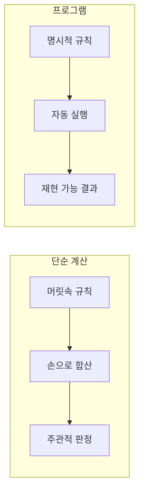
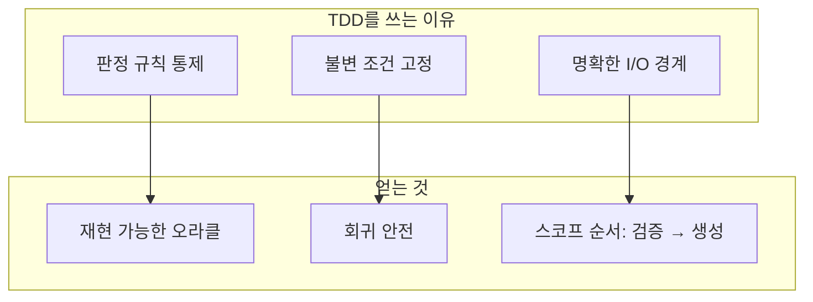

# 4x4 magic square problem definition
_Exported on 5/28/2026 at 13:59:45 GMT+9 from Cursor (3.5.17)_

---

**User**

당신은 문제 정의 전문가입니다. 나는 QA 전문가입니다.
나는 4x4 Magic Square 프로그램을 만들려고 합니다.
하지만 바로 설계하거나 구현하지 마십시오.
먼저 문제 인식 단계부터 진행하십시오.
--------------------------------------------
STEP 1 — Observation (관찰)
--------------------------------------------
다음 질문에 답하십시오:
1. 현재 우리가 해결하려는 상황은 무엇인가?
2. 왜 4x4 마방진 문제를 다루는가?
3. 이 문제는 어떤 학습 또는 시스템 설계 맥락에서 등장하는가?
“마방진을 만든다”는 표현 대신,상황을 관찰 관점으로 서술하십시오.


---

**Cursor**

프로젝트 맥락을 파악한 뒤, 관찰 관점에서 STEP 1에 답하겠습니다.


워크스페이스(`MagicSquare_xxx`)에는 아직 코드나 문서가 없습니다. 즉, **“무엇을 만들지”보다 “어떤 상황을 다루는지”를 먼저 고정하는 단계**에 있다고 보는 것이 맞습니다. 아래는 STEP 1 — Observation에 대한 답입니다.

---

## STEP 1 — Observation (관찰)

### 1. 현재 우리가 해결하려는 상황은 무엇인가?

**관찰 요약:**  
한 사람(QA 전문가)이 **4×4 격자에 1~16을 한 번씩 배치했을 때**, 행·열·대각선 합이 모두 동일한지(또는 그런 배치를 어떻게 얻는지)를 **프로그램으로 확인·생성·설명**할 수 있는지를 검토하려는 상황입니다.

**구체적 관찰:**

| 관찰 항목 | 내용 |
|-----------|------|
| **입력/출력의 형태** | 4×4 정수 격자, 보통 1~16 연속 사용 |
| **판정 기준** | 각 행·열·두 대각선의 합이 하나의 값(4차 마방진에서는 34)과 일치하는지 |
| **불확실성** | “모든 4×4 배열” vs “1~16을 쓰는 정규 마방진” vs “회전·대칭을 다른 것으로 볼지” 등 범위가 아직 열려 있음 |
| **환경** | 이름만 있는 빈 프로젝트 폴더 — 요구·제약·사용자는 아직 코드에 반영되지 않음 |
| **역할** | QA 관점에서 **기대 행동·경계·오류·재현 가능한 판정**을 어떻게 정의할지가 핵심 관심사로 보임 |

즉, 상황은 “수학 퍼즐 하나를 푼다”가 아니라, **“4×4 합 일치 격자에 대한 규칙을 소프트웨어가 일관되게 다루는지”를 앞으로 검증·구현할 준비를 하는 상황**입니다.

---

### 2. 왜 4×4 마방진 문제를 다루는가?

**관찰된 동기(추정 포함, 확인 필요):**

1. **규모가 작아 규칙이 명확함**  
   - 3×3보다 제약이 많고, 5×5보다 상태 공간이 작아 **입력·출력·판정 로직을 QA가 표로 정리하기 쉬움**.

2. **“맞음/틀림”이 수학적으로 정의됨**  
   - 모호한 UI보다 **행/열/대각 합**이라는 객관적 기준이 있어, 테스트 케이스·오라클(기대값) 설계에 적합함.

3. **알고리즘·구현·검증을 한 묶음으로 학습하기 좋음**  
   - 생성(Siamese 등은 홀수 위주), **검증**, **무작위/반마방진**, **대칭·회전 동치** 등 여러 층위를 같은 주제로 묶을 수 있음.

4. **프로젝트 이름과의 정합**  
   - `MagicSquare_xxx`라는 작업 공간은, **마방진을 주제로 한 연습·과제·포트폴리오·교육용 모듈**을 염두에 둔 신호로 읽힘 (xxx는 변형·버전·미정 스펙을 암시할 수 있음).

**아직 관찰되지 않은 것(다음 단계에서 물어볼 것):**  
- “반드시 **생성**까지 해야 하는지”, “**검증만** 하면 되는지”, “**사용자 입력**인지 **내부 생성**인지”는 이 관찰 단계에서는 확정되지 않았습니다.

---

### 3. 이 문제는 어떤 학습 또는 시스템 설계 맥락에서 등장하는가?

**학습 맥락(관찰):**

- **기초 프로그래밍 / 자료구조:** 2차원 배열, 반복, 합계 누적  
- **알고리즘 입문:** 백트래킹·휴리스틱·패턴 기반 채우기(4×4는 짝수 차수라 홀수 전용 공식과 다름)  
- **소프트웨어 테스트 교육:**  
  - 정상: 알려진 마방진  
  - 경계: 한 칸만 틀린 격자, 중복·누락 숫자  
  - 무효: 3×3 규칙을 4×4에 잘못 적용  
- **요구사항·도메인 모델링:** “마방진”의 정의를 코드와 테스트가 **같은 문장**으로 말하는지 연습

**시스템 설계 맥락(관찰):**

- **단일 책임:** `validate` / `generate` / `normalize`(회전·대칭) / `present` 분리 여부  
- **도메인 규칙 vs 표현:** 격자는 배열인가, 불변 객체인가  
- **확장성:** 나중에 3×3, 5×5, “마방 직사각형”, “반마방진”으로 키울지  
- **QA 관점의 시스템:**  
  - 재현 가능한 시드  
  - 결정적 판정 API  
  - 오류 메시지가 **어느 행/열/대각이 깨졌는지**까지 말할지

**등장하는 전형적 “시스템” 형태(아직 선택 전):**

- CLI 한 번 실행 → 격자 출력·합 검사  
- 라이브러리 함수만 (`isMagicSquare(grid)`)  
- 작은 웹/데스크톱 UI로 사용자가 칸을 채우고 즉시 피드백  
- 교육용: 단계별 힌트·부분 점수

현재 저장소 상태로 보면, 이 맥락들 중 **어느 하나로 좁혀지기 전**의 **문제 인식·스코프 합의 단계**에 있는 것으로 관찰됩니다.

---

## 관찰 관점 한 줄 정리

> **QA 전문가와 문제 정의자가, 아직 구현 없이, “4×4 격자에서 1~16을 어떻게 두었을 때 모든 주요 선의 합이 같다고 말할 수 있는가”를 공통 언어로 정의하고, 그에 맞는 프로그램의 역할(검증·생성·교육·확장)을 나중에 정하려는 초기 상황이다.**

---

다음 단계(STEP 2 — Problem framing)로 가려면, QA 관점에서 아래를 짧게 알려주시면 관찰을 “문제 문장”으로 옮기기 쉽습니다.

1. 최종 산출물은 **검증만** / **생성까지** / **둘 다** 중 어디에 가깝나요?  
2. 사용자는 **본인** / **학습자** / **자동 테스트** 중 누구인가요?  
3. “마방진” 정의: **1~16 필수**인가요, **임의 16개 정수**도 허용인가요?

원하시면 STEP 2에서 **문제 정의 문장(Problem Statement)**과 **In/Out of Scope** 초안을 이어서 작성하겠습니다. (여전히 설계·구현 없이)

---

**User**


--------------------------------------------
STEP 2 — Why #1
--------------------------------------------
Q: 왜 마방진을 완성해야 하는가?
A를 가정하여 답하고, 그 답에서 드러나는 불편함 또는 구조적 문제를 분석하십시오.


---

**Cursor**

STEP 2 — Why #1에서는 “완성”이 **무엇을 의미하는지**부터 분명히 두고, 그에 대한 가정 답을 세운 뒤, 그 답이 드러내는 **불편함·구조적 문제**를 분석합니다.

---

## 가정한 답 (A)

> **“4×4 격자에 1부터 16까지를 한 번씩 배치했을 때, 모든 행·열·두 대각선의 합이 34로 같아지는 상태를 만들어야, ‘이 배치가 마방진 규칙을 만족한다’고 주장할 수 있기 때문이다.”**

여기서 “완성”은 **수학적 조건 충족(합 일치 + 숫자 집합 규칙)** 을 의미한다고 가정합니다.  
(생성까지 포함하는 “완성”이 아니라, **판정 가능한 최종 상태**에 가깝습니다.)

---

## 이 답이 전제하는 것 (암묵적 구조)

| 전제 | 내용 |
|------|------|
| **단일 기준** | “완성” = 10개 선(행 4 + 열 4 + 대각 2)의 합이 모두 34 |
| **숫자 집합** | 정확히 {1,…,16}, 중복·누락 없음 |
| **주장 가능성** | 사람·프로그램이 “마방진이다”라고 말하려면 위 조건이 모두 참이어야 함 |
| **실패는 명확** | 하나라도 어기면 “미완성” 또는 “마방진 아님” |

QA 관점에서는 이 전제가 **테스트 오라클(기대값)** 을 주기 때문에 매력적입니다.

---

## 드러나는 불편함 (Experiential / Operational)

### 1. “완성”이 눈에 잘 안 보인다

- 합이 맞는지는 **전체를 다 본 뒤**에야 알 수 있음.
- 칸을 하나씩 채울 때 **부분적으로는 맞아 보이다가** 나중에 대각선이나 다른 행에서 깨지는 경우가 많음.
- **불편함:** 작업 중 피드백이 늦고, “거의 다 됐다”는 착각이 생김.

### 2. 실패 원인이 한곳에 안 모인다

- 34가 아닌 선이 여러 개일 수 있고, **어느 칸을 바꿔야 하는지** 한 번에 안 나옴.
- **불편함:** 수정 비용이 크고, 시행착오 반복(특히 수동 채우기·초보 학습자).

### 3. “완성”과 “거의 완성”의 경계가 가파름

- 9개 선만 맞고 1개만 틀려도 **전부 실패**로 취급됨.
- **불편함:** 학습·점수·UX에서 **부분 성취**를 표현하기 어렵움 (반마방진, 일부 선만 맞음 등은 별도 정의 필요).

### 4. 검증은 쉬운데 도달은 어렵다

- 답 가정은 “**검증 가능한 상태**가 있어야 주장할 수 있다”에 초점.
- 4×4 + 1~16은 **해가 존재**하지만, 무작위 채우기로 도달하기는 어렵음.
- **불편함:** “완성해야 한다”는 목표와 “어떻게 완성할지” 사이에 **방법론 공백**이 생김 (생성 알고리즘·패턴·힌트가 없으면 좌절).

---

## 구조적 문제 (Structural / Conceptual)

### 1. “완성” 정의와 사용자 목표가 어긋날 수 있음

| 구조적 긴장 | 설명 |
|-------------|------|
| **완성 = 합 일치** vs **완성 = 퍼즐 클리어** | 게임·교육에서는 “다 채웠다”가 완성인데, 수학적 완성은 **합·숫자 집합** |
| **완성 = 하나의 정답** vs **완성 = 동치 클래스** | 회전·대칭·숫자 치환까지 같은 “완성”으로 볼지 미정 |
| **완성 = 생성** vs **완성 = 검증 통과** | 프로그램이 만들어 주는지, 사용자가 맞추는지에 따라 요구가 갈림 |

→ **구조적 문제:** “완성해야 한다”는 Why 하나로는 **누가·무엇을·어디까지** 완성하는지 고정되지 않음. 이후 요구·테스트가 흔들림.

### 2. 판정 규칙은 이차원적이지만 실패는 고차원적

- 규칙: 격자 + 선별 합.
- 실패 원인: 특정 칸, 특정 숫자 쌍, 행/열/대각 **교차** 등.
- **구조적 문제:** 오라클은 boolean(`true/false`)인데, **진단 정보**(어느 선, 어느 칸)는 별도 설계 없으면 사라짐. QA는 “실패 케이스 분류”를 원하는데, 최소 API는 그걸 안 줌.

### 3. 4×4 짝수 차수의 특수성

- 홀수 마방진(Siamese 등)과 **다른 “완성 경로”** (스트라케치, 쌍 교환, 반마방진 등).
- “완성해야 한다”는 동기는 차수 무관하지만, **4×4만의 구조**(짝수, 34, 대각 포함 여부 등)가 붙음.
- **구조적 문제:** 문서·예제가 3×3 기준이면 **잘못된 완성 기준**을 그대로 가져오기 쉬움 (예: 대각선을 빼는 변형 마방진 vs 정규 마방진).

### 4. 완성 조건이 서로 독립이 아님

- 숫자 집합 {1..16} + 10개 선의 합 = **과제제약이 겹침**.
- 한 칸을 바꾸면 **여러 선이 동시에** 변함.
- **구조적 문제:** 단위 테스트를 “한 행만 맞으면 통과”처럼 쪼개기 어렵고, **통합·속성 기반** 검증 설계가 필요함 (부분 모듈의 의미가 약함).

### 5. “완성”이 곧 “유일”하지 않다

- 4×4 정규 마방진은 **본질적으로 여러 배치**(대칭·회전)가 존재.
- “완성해야 한다” → “**그중 하나**를 완성”인지, “**아무 유효한 하나**”인지, “**정해진 표준 답**”인지 불명확.
- **구조적 문제:** 자동 채점 시 **기대 격자 하나** vs **동치 허용** 에서 테스트 데이터·diff 전략이 갈림.

---

## Why #1에서 파생되는 핵심 갈등 (한 문장)

> **“합 34와 1~16을 모두 만족해야 주장할 수 있다”는 동기는 검증·QA에 유리하지만, 동시에 사용자 경험(진행 피드백·부분 성공)과 구현 범위(생성·동치·진단)를 이 답만으로는 결정하지 못해, ‘완성’ 주변에 구조적 공백이 생긴다.**

---

## STEP 3(Why #2)로 넘기기 위한 관찰 질문

다음 Why를 쪼개려면, 가정 A를 아래 중 하나로 **좁혀** 두는 것이 좋습니다.

1. **완성**이 꼭 “사용자가 손으로 채움”인가, “프로그램이 유효 격자를 출력”인가?  
2. **주장**의 주체는 누구인가 (학습자, 채점기, 라이브러리 소비자)?  
3. **동치**한 배치를 같은 완성으로 볼 것인가?

원하시면 가정을 하나 골라 주시면, STEP 2 — **Why #2** (“그래서 왜 그 주장이 필요한가?”)에서 같은 방식으로 **가정 A → 구조적 문제**를 이어가겠습니다.

---

**User**

--------------------------------------------
STEP 3 — Why #2
--------------------------------------------
Q: 왜 단순 계산이 아니라 프로그램으로 구현하는가?
다음 관점에서 답하십시오:
- 반복 가능성
- 검증 자동화
- 오류 방지
- 규칙 기반 사고 훈련


---

**Cursor**

STEP 3 — Why #2는 **“손계산·종이로도 되는 일을 왜 소프트웨어로 두는가?”**를 네 가지 렌즈로 정리하는 단계입니다. STEP 1·2의 맥락(4×4, 1~16, 합 34, QA·판정 중심)을 전제로 답합니다.

---

## 질문 재정의 (관찰)

**Q:** 왜 단순 계산(행·열·대각 합, 숫자 중복 확인)이 아니라 **프로그램**으로 다루는가?

**전제:** “단순 계산”은 사람이 격자를 보고 합을 더하고, 1~16이 맞는지 확인하는 수준을 말한다고 본다.

---

## 1. 반복 가능성 (Repeatability)

### 프로그램이 필요한 이유

| 관점 | 단순 계산 | 프로그램 |
|------|-----------|----------|
| **동일 입력** | 같은 격자를 두 번 검사해도 피로·주의력에 따라 절차가 달라질 수 있음 | 같은 입력 → 같은 판정 절차·같은 결과(결정적 설계 시) |
| **다량 케이스** | 수십·수백 격자를 일일이 검사하기엔 시간·인지 부담 큼 | 루프·데이터셋으로 **동일 규칙을 N번** 적용 가능 |
| **회귀** | 규칙을 바꾼 뒤(예: 대각선 포함 여부) “예전 케이스가 여전히 맞는지” 다시 손으로 돌리기 어려움 | 저장된 입력·기대값으로 **언제든 재실행** |
| **공유** | “내가 이렇게 검했다”는 절차가 말로만 전달됨 | 코드·스크립트·CI가 **절차 자체를 공유** |

### 드러나는 불편·구조 문제

- 손계산은 **“한 번 맞췄다”**와 **“항상 같은 방식으로 맞춘다”**가 다름 → QA는 후자가 필요함.
- 반복만으로는 **“무엇을 반복할지”**(격자 목록, 시드, 생성 vs 검증)가 정의되어야 함 → 프로그램을 쓰려면 **입력 형식·실행 환경**이 먼저 문제가 됨.

**한 줄:** 프로그램은 **판정 행위를 실험처럼 재현**하게 한다.

---

## 2. 검증 자동화 (Automated Verification)

### 프로그램이 필요한 이유

- 4×4 마방진 판정은 규칙이 **고정·유한**함: 행 4 + 열 4 + 대각 2 + (선택) 숫자 집합 → **기계적으로 분해 가능**.
- 자동화하면:
  - **오라클**을 코드와 테스트에 동일하게 둘 수 있음 (“34인가?” “1~16인가?”).
  - **실패 시 즉시 불리언 + (선택) 어느 선이 깨졌는지** 출력 가능.
  - CI·pre-commit·배치로 **사람 개입 없이** 통과/실패 판정.

### 단순 계산만으로는 부족한 지점

| 작업 | 손계산 | 자동 검증 |
|------|--------|-----------|
| 10개 합 동시 확인 | 실수·누락(대각 하나 빼먹기 등) | 누락 없이 일괄 |
| 경계 케이스 | “이런 격자도 한번 봐줘”가 비체계적 | 테스트 스위트에 **명시적 등록** |
| 채점 | 주관·피로 | 동일 기준 **일괄 채점** |
| 문서와 실행의 일치 | 요구서와 머릿속 규칙이 어긋날 수 있음 | **실행 가능한 명세**에 가까워짐 |

### 드러나는 불편·구조 문제

- 자동화의 전제는 **“마방진” 정의가 코드에 고정**되어야 함 → STEP 2에서 말한 **동치·대각 포함·반마방진** 미정이면 자동화도 흔들림.
- `true/false`만 자동화하면 **진단 부족**; QA는 실패 **분류·재현 스텝**까지 원할 수 있음 → API/출력 설계가 Why #2의 연장선이 됨.

**한 줄:** 프로그램은 **규칙을 실행 가능한 검증기**로 바꾼다.

---

## 3. 오류 방지 (Error Prevention)

### 프로그램이 막는 오류 유형

| 오류 유형 | 손계산에서 흔함 | 프로그램에서 |
|-----------|-----------------|--------------|
| **산술 실수** | 한 줄 합 오산 | 동일 연산 반복, 단위 테스트로 연산 자체 검증 |
| **절차 누락** | 대각선·중복 검사 생략 | 검사 목록을 코드에 **강제** |
| **기준 혼동** | 3×3용 15를 4×4에 적용, 32/34 혼동 | 상수·차수를 매개변수로 고정 |
| **일관성 없는 판정** | “거의 맞음”을 통과로 처리 | 규칙이 명시되면 **이분** (통과/실패) |
| **데이터 오입력** | 칸 번호·행열 뒤바뀜 | 파싱·스키마 검증으로 **입력 단계**에서 차단 |

### “단순 계산”이 오히려 안전한 경우 (균형)

- 격자 **한 개**, 학습 **첫 주** → 손으로 합을 더하는 경험이 **개념 이해**에 유리함.
- 프로그램은 **잘못된 규칙을 빠르고 확실하게** 반복할 수 있음 → 버그 있는 검증기 = **체계적 오판**.

### 드러나는 구조 문제

- 오류 방지는 **검증 로직이 맞을 때**만 성립 → 검증기 자체에 대한 **메타 테스트**(알려진 마방진/비마방진)가 필요함 (QA 이중화).
- 생성까지 넣으면 “잘못된 생성기가 올바른 것처럼 보이게” 할 위험 → **생성과 검증 분리**가 구조적 권장사항으로 드러남.

**한 줄:** 프로그램은 **사람의 주의력 의존을 줄이되**, 규칙 정의 오류는 **테스트로** 막아야 한다.

---

## 4. 규칙 기반 사고 훈련 (Rule-based Thinking)

### 프로그램이 훈련에 기여하는 방식

- **규칙을 명문화:** “완성”을 자연어가 아니라 **조건의 AND**로 쪼갬  
  - 예: `∀ row: sum(row)==34` ∧ `∀ col: …` ∧ `is_permutation(1..16)`.
- **추상화:** “4×4”를 **n×n, magic constant, cell set**으로 일반화할지 결정하게 함.
- **경계·반례:** 규칙을 코드로 옮기면 “이 격자는 왜 실패?”를 **케이스로 축적**하기 쉬움.
- **역할 분리 훈련:** 도메인 규칙 / 입출력 / 표현 / UI — **어디에 규칙을 둘지** 설계 질문이 생김.

### 단순 계산만 할 때의 한계

- 규칙이 **머릿속·구두**에 남아 **버전 관리·리뷰**가 어려움.
- “대각선 포함” 같은 **한 줄 정의 차이**가 팀마다 다를 수 있음.
- 패턴 인식(대칭, 스왑)과 **논리적 판정**이 섞여 **테스트 가능한 명세**로 안 내려옴.

### QA·학습 맥락에서의 의미

- 테스트 케이스 작성 = **규칙을 예시로 구체화**.
- 실패 메시지 설계 = **규칙 위반을 인간이 이해하는 언어로 역번역**.
- 이는 “코딩 연습”이 아니라 **요구·도메인·검증을 한 줄기로 묶는 연습**.

### 드러나는 구조 문제

- 규칙을 코드로 옮기는 순간 **“교육용 느슨한 규칙”**과 **“엄격한 판정”**이 충돌할 수 있음 (부분 점수 vs 전부 통과).
- 훈련 목표가 **알고리즘 이해**인지 **명세·테스트 설계**인지에 따라 **프로그램 범위**가 달라짐 → Why #2만으로는 스코프 미결.

**한 줄:** 프로그램은 **애매한 직관을 검증 가능한 규칙 묶음**으로 바꾸는 도구다.

---

## 네 관점 통합 (Why #2 종합 답)

> **4×4 마방진은 “합 몇 번 더하기”로는 끝나지만, 그 계산을 신뢰할 수 있는 산출(재현·자동 판정·실수 감소·명시적 규칙)이 필요할 때 프로그램이 의미를 갖는다.**  
> QA 맥락에서는 특히 **같은 규칙으로 많은 격자를 같은 기준으로 판정하고, 그 규칙이 문서·테스트·코드에서 일치하게 만드는 것**이 핵심 동기다.



---

## STEP 3에서 새로 드러난 구조적 긴장 (STEP 4 힌트)

| 긴장 | 내용 |
|------|------|
| **최소 프로그램** | 검증 함수 하나 vs CLI vs 테스트 스위트만 |
| **과잉 자동화** | 학습 초기에 손계산을 건너뛰면 개념 공백 |
| **규칙의 출처** | 코드가 규칙의 원천인가, 수학 정의가 원천인가 |
| **이중 검증** | 검증기 테스트 없이는 “자동화 = 안전”이 성립하지 않음 |

---

## Why #2 한 문장 (가정 포함)

> **“단순 계산은 한두 격자의 이해에는 충분하지만, 마방진 판정을 반복·공유·채점·회귀 가능하게 만들고 사람의 산술·절차 실수를 줄이며, ‘무엇이 마방진인가’를 팀이 공유하는 규칙으로 고정하려면 프로그램(및 그 위의 자동 테스트)이 필요하다.”**

---

다음 **STEP 4 — Why #3** 후보 질문 예시:

- “왜 **지금** 프로그램인가?” (학습 단계·데드라인·팀 규모)  
- “왜 **전체 시스템**이 아니라 **검증 코어만**인가?”

원하시면 STEP 4도 같은 형식(가정 A → 불편·구조 문제)으로 이어가겠습니다.

---

**User**

--------------------------------------------
STEP 4 — Why #3 (핵심 발견)
--------------------------------------------
Q: 왜 이 문제를 TDD 방식으로 설계하려 하는가?
- 무엇이 통제되어야 하는가?
- 어떤 불변 조건이 존재하는가?
- 왜 입력/출력이 명확해야 하는가?


---

**Cursor**

STEP 4 — Why #3는 **“4×4 마방진을 TDD로 다루려는 이유”**를 핵심 발견 관점에서 정리하는 단계입니다. 앞선 단계(판정·재현·자동 검증·규칙 명문화)와 이어서 답합니다.

---

## 질문 재정의

**Q:** 왜 이 문제를 **TDD 방식으로 설계**하려 하는가?

**전제:** TDD는 “테스트를 먼저 쓰고, 실패하는 테스트를 통과시키는 최소 구현을 반복한다”는 **설계·개발 절차**를 말한다. 여기서는 구현 언어보다 **문제를 테스트 가능한 단위로 쪼개는 설계 철학**에 초점을 둔다.

---

## 1. 무엇이 통제되어야 하는가?

TDD를 선택한다는 것은, 다음이 **통제 불가·암묵·사람마다 다름**으로 남으면 프로젝트가 무너진다고 보는 것과 같다.

### 통제 대상 맵

| 통제 대상 | 통제하지 않으면 생기는 일 | TDD가 거는 장치 |
|-----------|---------------------------|-----------------|
| **“마방진”의 정의** | 3×3 규칙, 대각 제외, 1~16 누락 등 혼선 | 실패/통과 테스트로 **정의 고정** |
| **판정 결과** | “거의 맞음”, “대각만 틀림” 등 주관 | 테스트가 기대하는 **boolean·메시지** 고정 |
| **매직 상수** | 32/34 혼동, n 변경 시 깨짐 | `expected_sum = 34` 등 **상수 테스트** |
| **숫자 집합 규칙** | 중복·범위 밖 허용 여부 불명 | permutation / set 테스트 |
| **회귀** | 리팩터 후 “예전에 맞던 격자” 재검증 안 함 | **고정 픽스처** 재실행 |
| **범위(스코프)** | 생성·UI·최적화가 한꺼번에 섞임 | **검증만** 먼저 통과하는 테스트로 순서 강제 |
| **검증기 자체의 정확성** | 버그 있는 `isMagic`이 전부 통과 | **알려진 정·부정 케이스** 스위트 |

### QA 관점에서의 “통제”

- **통제 = 측정 가능 + 재현 가능 + 기준 문서화**
- TDD는 “코드가 맞다”가 아니라 **“이 테스트 집합을 통과하는 것이, 우리가 합의한 마방진 정의다”**를 통제한다.
- 특히 **검증 로직과 생성 로직을 분리**할 때, 생성기가 틀려도 검증기는 **독립된 오라클**로 남게 한다.

### 핵심 발견 (통제)

> **통제해야 하는 것은 “구현 속도”가 아니라 “판정 규칙의 버전”이다.**  
> TDD는 규칙 변경 시 **어떤 테스트가 깨져야 하는지**를 먼저 보여 주는 **변경 영향 알람** 역할을 한다.

---

## 2. 어떤 불변 조건이 존재하는가?

**불변 조건(invariant)** 은 입력·구현이 바뀌어도 **항상 참이어야 하는 성질**이다. 4×4 마방진 도메인에는 수학적 불변과 **시스템이 약속할 불변**이 겹쳐 있다.

### A. 도메인(수학) 불변 — 검증의 오라클

| 불변 | 4×4, 1~16 정규 마방진에서 | 테스트에서의 표현 |
|------|---------------------------|-------------------|
| **매직 합** | 모든 행·열·(정의 시) 대각 합 = **34** | `sum(row_i)==34`, `sum(col_j)==34`, … |
| **셀 집합** | 격자 원소는 **{1,…,16}의 순열** (중복·누락 없음) | `sorted(flat)==[1..16]` |
| **크기** | **4×4** | `len(grid)==4`, `∀ row: len(row)==4` |
| **선 개수** | 행 4 + 열 4 + 대각 2 = **10개 합 검사** (정의에 포함 시) | 10개 assertion 또는 루프 불변 |

※ “대각선을 마방진에 포함할지”는 **도메인 변형**이지 수학 절대식이 아님 → 불변 목록에 **명시적으로 적거나 제외**해야 함 (STEP 2의 구조적 공백).

### B. 생성·탐색 시 불변 (나중 단계)

| 불변 | 의미 |
|------|------|
| **부분 배치** (백트래킹) | 아직 안 채운 칸을 제외하면, 채운 부분의 행/열 합이 34를 **초과하지 않음** 등 pruning 조건 |
| **대칭** | 회전·반사한 격자도 **동일하게 “유효”** (동치 클래스 — 판정 불변, “표준 답” 불변은 아님) |

### C. 시스템(프로그램) 불변 — TDD가 특히 지키게 하는 것

| 불변 | 내용 |
|------|------|
| **결정성** | 같은 `grid` 입력 → 같은 `isValid` / 같은 진단 |
| **순수성** (검증 코어) | 검증 함수는 부수 효과 없이 **입력 격자만**으로 판정 |
| **단조적 실패** | 규칙을 강화하면(예: 대각 추가) 이전 통과 케이스 중 일부만 실패 — **의도된 깨짐** |
| **분리** | `validate(grid)`가 참이면, 그 grid는 **생성 경로와 무관**하게 마방진 |

### D. 테스트 스위트 자체의 불변

- **알려진 참 격자** 하나 이상: 항상 `true`
- **알려진 거짓 격자** 여러 종류: 항상 `false` (한 줄만 틀림, 중복 숫자, 잘못된 차수, …)
- 리팩터 후에도 이 스위트는 **녹색 유지** (행동 불변)

### 핵심 발견 (불변)

> **마방진 문제의 본질은 “상태를 만드는 것”보다 “불변을 만족하는지 판별하는 것”에 가깝다.**  
> TDD는 **불변을 테스트 이름·assertion으로 고정**하므로, 구현이 바뀌어도 **의미(불변)는 지킨다**는 계약이 생긴다.

---

## 3. 왜 입력/출력이 명확해야 하는가?

TDD의 한 사이클은 **Given → When → Then**이다. 입력/출력이 흐리면 **테스트를 쓸 수 없고**, 테스트를 쓸 수 없으면 TDD가 아니라 **구현 후 수동 확인**으로 돌아간다.

### 명확해야 하는 이유 (네 가지)

**① 테스트가 곧 명세이기 때문**

- 모호한 명세: “마방진이면 OK”
- 명확한 I/O: `is_magic_square(grid: int[4][4]) -> bool` (+ 선택 `diagnostics`)
- QA: **애매함 = 결함의 온상** → I/O가 명세의 경계

**② 실패를 재현하기 때문**

- 입력: 어떤 4×4 배열(또는 파일/문자열 파싱 결과)
- 출력: `false` + (선택) `failed_lines: ["row2", "diag1"]`
- 재현: **같은 grid 파일 → 같은 실패** (STEP 3 반복 가능성)

**③ 범위를 잘라 내기 때문**

| 모호한 I/O | 명확한 I/O |
|------------|------------|
| “사용자가 만든 판” | `int[4][4]` 또는 16개 정수 리스트 |
| “출력” | `bool` / `ValidationResult` |
| “에러” | `InvalidDimension`, `OutOfRange`, `Duplicate` 등 **구분** |

**④ 단계적 TDD 순서를 강제하기 때문**

전형적 순서 예 (설계만, 구현 아님):

1. `valid_known_magic` → `true`
2. `wrong_row_sum` → `false`
3. `duplicate_number` → `false`
4. `not_1_to_16` → `false`
5. (나중) `generate()` → `validate(result)==true`

입력/출력이 각 단계마다 다르면 **이전 테스트가 다음을 깨뜨림** → 통제 상실.

### 입력/출력 명세 초안 (문제 정의 수준)

```
입력:  grid — 4개의 길이 4인 정수 시퀀스 (또는 파싱 가능한 동등 표현)
출력:  valid: bool
       (선택) violations: list of { kind: row|col|diag|set, index: int }
전제:  정수만; null 없음; 빈 칸 표현은 0 또는 Optional — 반드시 하나로 고정
```

**아직 결정하지 않으면 TDD가 멈추는 지점:** 빈 칸 `0` vs `-1` vs `None`, 문자열 `"4x4"` 파싱 규칙, 동치 격자를 같은 출력으로 볼지.

### 핵심 발견 (I/O)

> **입력/출력이 명확하지 않으면 “테스트 먼저”가 아니라 “테스트를 나중에 맞추는 형식 검증”이 된다.**  
> TDD로 설계한다는 것은 **API 경계에서 애매함을 제거하는 것**이 1차 목표이고, 코드 작성은 2차다.

---

## STEP 4 핵심 발견 — 통합 (Why #3)



**한 문장:**

> **4×4 마방진은 규칙은 단순하지만 정의 변형·사람 실수·범위 비대가 위험하므로, TDD는 “무엇을 통제할지(판정 규칙)”, “무엇이 절대 깨지면 안 되는지(합 34·1~16·차원)”, “무엇이 함수 경계를 넘는지(격자 in → 판정 out)”를 먼저 고정하는 설계 방식이다.**

---

## TDD 선택에서 드러나는 구조적 문제 (다음 단계로 넘길 것)

| 문제 | 설명 |
|------|------|
| **불변 목록 미완** | 대각 포함·동치·반마방진 미정 → 테스트 이름부터 갈림 |
| **오라클 이중화** | 생성기 테스트가 검증기에만 의존하면 **순환 신뢰** |
| **과도한 첫 테스트** | UI·파일·CLI부터 TDD하면 I/O가 폭발 |
| **교육 vs 엄격** | 부분 점수 요구는 boolean 불변과 충돌 → 별도 `score` 출력 필요 |

---

## STEP 5 후보 (Problem Statement 초안)

다음 단계에서 아래를 **한 페이지 문제 정의**로 묶을 수 있다.

- **목표:** `validate(4×4 grid)` — 합 34, 1~16, (대각 포함 여부 TBD)
- **1차 불변:** 위 표 A
- **1차 I/O:** `grid` → `bool` (+ optional diagnostics)
- **TDD 1번 테스트:** 알려진 4×4 마방진 하나 → `true`

원하시면 STEP 5에서 **Problem Statement + In/Out of Scope + 첫 5개 테스트 시나리오(구현 없음)** 만 작성하겠습니다.

---

**User**


--------------------------------------------
STEP 5 — 진짜 문제 정의
--------------------------------------------
다음을 작성하십시오:
1. 표면 문제 정의 (잘못된 정의)
2. 개선된 문제 정의 (정확한 정의)
3. 이 문제의 핵심 Invariant
4. 우리가 실제로 훈련하려는 사고 능력
−	구현 설계는 하지 마십시오.
−	코드 언급 금지.
−	알고리즘 설명 금지.
−	구조화된 Markdown으로 작성하십시오.


---

**Cursor**

# STEP 5 — 진짜 문제 정의

4×4 마방진 프로그램 · 문제 인식·정의 단계 (구현·알고리즘·코드 없음)

---

## 1. 표면 문제 정의 (잘못된 정의)

> **“4×4 칸에 1부터 16까지 숫자를 넣어서, 행·열·대각선 합이 같은 마방진을 완성하는 프로그램을 만든다.”**

### 왜 잘못된 정의인가

| 결함 | 설명 |
|------|------|
| **목표 혼재** | “완성(생성)”과 “판정(검증)”이 한 문장에 섞여 있음 |
| **규칙 미명시** | 어떤 선까지 합을 볼지, 어떤 숫자 집합을 허용할지 불명 |
| **성공 기준 모호** | “합이 같다”만으로는 매직 상수·차원·중복 규칙이 빠짐 |
| **사용자·맥락 부재** | 누가, 언제, 무엇을 위해 쓰는지 없음 |
| **품질 속성 없음** | 재현·회귀·일관 판정·실패 설명 등 QA 관심이 반영되지 않음 |
| **확장 착시** | “마방진 프로그램”이 곧 퍼즐 앱·최적화·교육 UI까지 포함하는 것처럼 읽힘 |

### 이 정의가 만드는 위험

- 요구와 테스트가 **“돌아가는 데모”** 쪽으로 치우침  
- 팀마다 **다른 마방진**을 각자 구현하고 나중에 합의 실패  
- “거의 맞은 격자”를 어떻게 다룰지 논의 없이 개발 시작  

---

## 2. 개선된 문제 정의 (정확한 정의)

### 2.1 한 문장 정의

> **“4×4 정수 격자가 주어졌을 때, 합의 일치·숫자 집합·격자 형식에 대한 **공유된 판정 규칙**을 적용해, 마방진 여부를 **재현 가능하고 일관되게** 결정하고, 그 규칙을 팀이 검토·변경·회귀 확인할 수 있게 만드는 것이 본 문제이다.”**

### 2.2 문제의 본질 (무엇이 아닌지 / 무엇인지)

| 이것은 본질이 아님 | 이것이 본질에 가까움 |
|------------------|---------------------|
| 퍼즐을 재미있게 푸는 UI | **판정 규칙의 명시와 준수** |
| 하나의 정답 격자를 찾아내기 | **임의 격자에 대한 일관된 참/거짓** |
| 손으로 합을 더하는 연습 | **규칙을 반복·공유·자동 검증 가능한 형태로 고정** |
| 4×4만의 수학 연구 | **제한된 도메인에서 요구·검증·불변을 맞추는 연습** |

### 2.3 범위 (문제 정의 수준)

**In scope (1차)**

- 4행 4열 격자에 대한 **유효성 판정**  
- 숫자 집합: **1 이상 16 이하, 각 값 정확히 한 번** (순열)  
- **행 4개·열 4개·두 대각선** 각각의 합이 **34**와 일치하는지  
- 동일 격자에 대한 **동일 판정 결과** (재현성)  
- 알려진 참·거짓 격자로 **판정 규칙 자체를 점검**할 수 있음  

**Out of scope (1차, 명시적 제외)**

- 격자 **생성·추천·힌트**  
- 회전·대칭 등 **동치를 같은 답으로 묶는 정규화**  
- 3×3·5×5 등 **다른 차수**  
- 부분 점수·“거의 마방진” **등급**  
- 사용자 인터페이스·파일 형식·배포  

**의도적으로 미결 (합의 전까지 구현 금지 권장)**

- 빈 칸·미입력 칸의 표현  
- 판정 실패 시 **진단 정보**를 어디까지 제공할지  
- 생성 단계를 2차 범위에 넣을지 여부  

### 2.4 이해관계자와 성공

| 역할 | 이 문제에서의 관심 |
|------|-------------------|
| **QA** | 규칙이 문서·판정·테스트(개념)에서 일치하는지, 회귀 가능한지 |
| **문제 정의자** | 표면 요구와 진짜 요구 분리, 스코프 고정 |
| **구현자(미래)** | 모호함 없이 “통과/실패” 경계 구현 (본 문서는 설계하지 않음) |
| **학습자** | 손계산과 자동 판정의 차이, 규칙 명문화 경험 |

**성공이란:**  
합의된 판정 규칙에 대해, 누가 언제 실행해도 **같은 격자 → 같은 결론**이며, 규칙 변경 시 **어떤 기대가 바뀌는지** 추적 가능한 상태.

### 2.5 표면 정의 vs 개선 정의 대조

| 항목 | 표면 정의 | 개선된 정의 |
|------|-----------|-------------|
| 중심 동사 | 완성한다 | **판정한다** (1차) |
| 대상 | 마방진 하나 | **임의의 4×4 격자** |
| 규칙 | “합이 같다” | **합=34, 1~16 순열, 10개 선** (합의 필요) |
| 품질 | 없음 | **재현·일관·회귀 가능** |
| 산출 | 프로그램 데모 | **공유 가능한 판정 규칙과 그 검증 체계** |

---

## 3. 이 문제의 핵심 Invariant

불변 조건: **어떤 구현·누가 실행하든 깨지면 안 되는 성질** (도메인 + 시스템 약속).

### 3.1 도메인 불변 (판정 오라클)

| ID | 불변 | 위반 시 |
|----|------|---------|
| **D1** | 격자는 **4×4**이다 | 판정 대상 아님 또는 형식 오류로 거부 |
| **D2** | 모든 셀은 **1 이상 16 이하 정수**이며, **16개 값이 서로 다르다** | 마방진 아님 (집합 규칙 위반) |
| **D3** | **각 행**의 4개 합은 **34**이다 | 마방진 아님 |
| **D4** | **각 열**의 4개 합은 **34**이다 | 마방진 아님 |
| **D5** | **주대각선·부대각선** 각 4개 합은 **34**이다 | 마방진 아님 (본 프로젝트에서 대각 포함으로 합의한 경우) |
| **D6** | D2~D5를 **모두** 만족할 때만 “마방진이다” | 일부만 맞으면 마방진 아님 |

**논리적 관계:** D6 = D2 ∧ D3 ∧ D4 ∧ D5 (대각 포함 정의 하에서).

### 3.2 판정 시스템 불변 (프로세스·품질)

| ID | 불변 | 의미 |
|----|------|------|
| **S1** | 동일 격자 입력 → **동일 판정 결과** | 재현 가능성 |
| **S2** | 판정은 **격자 데이터만**으로 결정 (실행 시점·실행자에 무관) | 공정·채점 가능 |
| **S3** | 규칙 정의가 바뀌지 않는 한, **고정된 참·거짓 예시**의 판정은 변하지 않음 | 회귀 기준 |
| **S4** | “마방진이다” 주장은 **D1~D6(합의된 집합) 검사 통과** 없이는 하지 않음 | 주장과 규칙 일치 |
| **S5** | (1차) **생성 경로와 무관**하게, 통과한 격자는 동일하게 “마방진” | 검증 독립성 |

### 3.3 테스트·합의 불변 (TDD·QA 맥락)

| ID | 불변 | 의미 |
|----|------|------|
| **T1** | **최소 하나의 참 격자**는 항상 “마방진”으로 판정 | 오라클 생존 |
| **T2** | **의도된 거짓 격자**(한 줄만 틀림, 중복, 잘못된 차수 등)는 항상 “아님” | 오라클 구분력 |
| **T3** | 불변 D3~D5 중 하나를 규칙에서 제거하면, **영향 받는 예시의 기대가 문서화되어 변경** | 규칙 버전 통제 |

### 3.4 의도적으로 불변으로 삼지 않는 것

- “유일한 정답 격자 하나”  
- 회전·대칭한 배치를 같은 것으로 보는 것  
- 사용자 만족도·퍼즐 난이도  

---

## 4. 우리가 실제로 훈련하려는 사고 능력

구현 기술이 아니라, **문제를 다루는 방식**을 훈련한다.

### 4.1 능력 맵

| # | 사고 능력 | 훈련 내용 | 이 문제에서의 연습 |
|---|-----------|----------|-------------------|
| **1** | **문제 분리** | 하나의 문장에 섞인 목표를 쪼갬 | “만든다” vs “판정한다” 분리 |
| **2** | **규칙 명문화** | 구두·직관을 검사 가능한 조건으로 고정 | 10개 선·집합·34를 각각 독립 조건으로 명시 |
| **3** | **오라클 사고** | “맞다/틀리다”의 기준을 외부에 고정 | 참·거짓 격자 예시로 판정 규칙 검증 |
| **4** | **불변 식별** | 바뀌면 안 되는 것 vs 바뀔 수 있는 것 구분 | D1~D6 vs UI·표현·생성 |
| **5** | **경계·스코프 통제** | 1차에 넣지 않을 것을 명시 | 생성·동치·부분 점수 제외 |
| **6** | **재현·회귀 마인드** | 같은 입력·같은 규칙 → 같은 결론 | S1·S3, 규칙 변경 시 영향 추적 |
| **7** | **실패 구조화** | “틀림”을 원인 유형으로 분류 | 행/열/대각/집합 위반 구분 (개념 수준) |
| **8** | **요구–검증 정렬** | QA와 정의자가 같은 문장으로 말하기 | 개선 정의 = 테스트 의도의 상위 문장 |
| **9** | **가정 표시** | 아직 합의 안 된 것을 숨기지 않기 | 대각 포함·진단 깊이 TBD 표기 |
| **10** | **과잉 해결 억제** | 작은 도메인에 전체 앱 욕심 내리기 | 4×4 판정 코어에 집중 |

### 4.2 훈련하지 않는 것 (명시)

- 특정 언어·프레임워크 숙련  
- 최적 생성 기법·휴리스틱  
- UI·UX 설계  
- 수학적 증명 일반화 (n차 마방진 이론)  

### 4.3 역할별 기대

| 역할 | 훈련 후 기대 상태 |
|------|-------------------|
| **QA** | 스코프 밖 요구를 조기에 걸러내고, 불변·예시로 테스트 의도 서술 |
| **문제 정의자** | 표면 요구를 받아도 진짜 문제 문장으로 재작성 |
| **공동** | “마방진”을 말할 때 **D1~D6 합의 문장**을 가리킴 |

---

## 5. STEP 5 핵심 발견 (한 블록)

> **진짜 문제는 “16칸 퍼즐을 채우는 것”이 아니라, “4×4 격자에 대한 마방진 판정 규칙을 팀이 공유하고, 그 규칙이 재현·회귀 가능하게 유지되는지”이다.**  
> 표면 정의는 구현 욕심과 모호한 “완성”을 부르고, 개선 정의는 **판정·불변·스코프**로 초점을 옮긴다.  
> 우리가 훈련하는 것은 마방진 자체보다 **규칙·불변·경계를 다루는 문제 정의·QA 사고**이다.

---

## 6. 다음 단계 제안 (구현 없음)

합의 체크리스트만 제시한다.

- [ ] 대각선 D5를 1차 불변에 **포함**하는지 최종 확인  
- [ ] 판정 실패 시 **진단 수준** (없음 / 어떤 선 / 어떤 칸) 결정  
- [ ] **참 격자·거짓 격자** 예시 각각 최소 개수 합의  
- [ ] 2차 범위에 **생성**을 넣을지 시점 결정  

원하시면 STEP 6에서 **첫 판정 시나리오 목록(Given–When–Then, 코드·알고리즘 없음)** 만 이어서 작성할 수 있습니다.

---

**User**

다음의 순서로 실행해줘
1. Report 폴더에 보고서 생성해줘
2. 현재까지의 프롬프트 전체를 대화형 프롬프트로 Prompt 폴더에 Export transcript 해줘


---

**Cursor**

Report와 Prompt 폴더에 문서를 생성합니다. 워크스페이스 구조를 확인한 뒤 STEP 1–5 보고서와 대화형 프롬프트보내기를 작성합니다.


Report와 Prompt 폴더에 통합 보고서와 대화형 프롬프트보내기를 작성합니다.


작업을 반영했습니다. 생성된 파일은 다음과 같습니다.

## 1. Report 폴더 — 통합 보고서

| 파일 | 설명 |
|------|------|
| [Report/4x4_MagicSquare_Problem_Definition_Report.md](c:\dev\MagicSquare_xxx\Report\4x4_MagicSquare_Problem_Definition_Report.md) | STEP 1~5 전체 요약, Executive Summary, Invariant·합의 체크리스트 |

포함 내용: 관찰 → Why #1~#3 → 진짜 문제 정의 → 핵심 발견 mermaid → 다음 단계 체크리스트

---

## 2. Prompt 폴더 — 대화형 Transcript Export

| 파일 | 설명 |
|------|------|
| [Prompt/MagicSquare_Interactive_Prompt_Transcript.md](c:\dev\MagicSquare_xxx\Prompt\MagicSquare_Interactive_Prompt_Transcript.md) | **대화형 재실행용** — 시스템 역할, Turn 1~6 USER 원문, 기대 산출물, `▶ CONTINUE`, Single-shot 일괄 프롬프트 |
| [Prompt/transcript_export.json](c:\dev\MagicSquare_xxx\Prompt\transcript_export.json) | 기계 가독 JSON — turn/step/role/prompt·summary, artifact 메타 |

**대화형 사용:** `MagicSquare_Interactive_Prompt_Transcript.md`에서 SYSTEM 블록을 붙인 뒤 Turn 1 USER부터 순서대로 진행하거나, 하단 **Single-shot** 블록으로 STEP 1~5를 한 번에 요청할 수 있습니다.

---

Agent transcript 참조: [0ddc19ef-bf4b-469a-b4e5-4bdb016e2e9b](0ddc19ef-bf4b-469a-b4e5-4bdb016e2e9b)

STEP 6(판정 시나리오 Given–When–Then) 문서화도 원하시면 이어서 작성할 수 있습니다.

---

**User**

@Report/4x4_MagicSquare_Problem_Definition_Report.md 목차를 추가하고 각각 스텝을 좀더 상세하게 적어줘

---

**Cursor**

목차를 추가하고 각 STEP 섹션을 대화 내용을 반영해 상세히 확장합니다.


보고서를 갱신했습니다.

## 변경 사항

**파일:** [Report/4x4_MagicSquare_Problem_Definition_Report.md](c:\dev\MagicSquare_xxx\Report\4x4_MagicSquare_Problem_Definition_Report.md) (v1.1)

### 추가된 목차
- Executive Summary ~ 부록까지 **9개 대목차**
- STEP 1~5 **하위 절 링크** (GitHub/Cursor Markdown 앵커)

### STEP별 상세화 요약

| STEP | 확장 내용 |
|------|-----------|
| **STEP 1** | 관찰 매트릭스, 관찰 관점 서술 표, 4×4 동기 4항, 학습/시스템 표, 시스템 형태 4종, **미확정 5항**, 핵심 발견 |
| **STEP 2** | 질문 재정의, 가정 A·완성 정의·암묵 전제, 불편함 4종 **상세+이해관계자**, 구조 문제 5종 **STEP 5 대응**, 긴장 3종, 연결 질문 |
| **STEP 3** | 네 관점 각각 **비교표·드러나는 문제·한 줄**, 손계산 균형, 통합 문장, 구조적 긴장 표 |
| **STEP 4** | 통제 맵 7항, 불변 A~D, I/O 4理由·명세 초안·TBD, TDD 통합·구조 문제 |
| **STEP 5** | 결함 6항·위험, In/Out/TBD 표, 이해관계자·성공 정의, D/S/T 불변 전체, 사고 능력 10항 표 |

### 기타
- 합의 체크리스트 **6항**으로 확장
- 문서 이력 v1.1 기록

목차 링크가 뷰어에서 안 열리면 알려주세요. 앵커 형식을 그 환경에 맞게 조정할 수 있습니다.

