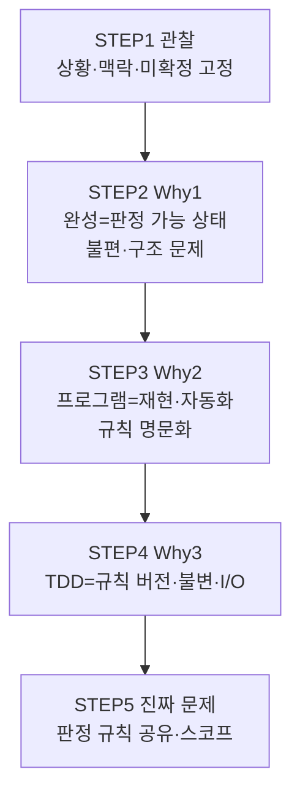

# 4×4 Magic Square — 문제 인식·정의 보고서

| 항목 | 내용 |
|------|------|
| **프로젝트** | MagicSquare_xxx |
| **단계** | STEP 1 ~ STEP 5 (문제 인식·정의) |
| **역할** | 문제 정의 전문가 × QA 전문가 |
| **작성일** | 2026-05-28 |
| **버전** | 1.1 |
| **상태** | 구현·설계 전 — 요구·불변·스코프 합의 문서 |

---

## 목차

1. [Executive Summary](#executive-summary)
2. [STEP 1 — Observation (관찰)](#1-step-1--observation-관찰)
   - [1.1 현재 해결하려는 상황](#11-현재-해결하려는-상황)
   - [1.2 관찰 관점의 상황 서술](#12-관찰-관점의-상황-서술)
   - [1.3 왜 4×4 마방진을 다루는가](#13-왜-4x4-마방진을-다루는가)
   - [1.4 학습·시스템 설계 맥락](#14-학습시스템-설계-맥락)
   - [1.5 아직 관찰되지 않은 것](#15-아직-관찰되지-않은-것)
   - [1.6 STEP 1 핵심 발견](#16-step-1-핵심-발견)
3. [STEP 2 — Why #1 (왜 완성해야 하는가)](#2-step-2--why-1-왜-완성해야-하는가)
   - [2.1 질문 재정의](#21-질문-재정의)
   - [2.2 가정한 답 (A)와 암묵적 전제](#22-가정한-답-a와-암묵적-전제)
   - [2.3 불편함 (Operational)](#23-불편함-operational)
   - [2.4 구조적 문제 (Structural)](#24-구조적-문제-structural)
   - [2.5 핵심 갈등과 STEP 3 연결 질문](#25-핵심-갈등과-step-3-연결-질문)
4. [STEP 3 — Why #2 (왜 프로그램인가)](#3-step-3--why-2-왜-프로그램인가)
   - [3.1 질문 재정의](#31-질문-재정의)
   - [3.2 반복 가능성](#32-반복-가능성)
   - [3.3 검증 자동화](#33-검증-자동화)
   - [3.4 오류 방지](#34-오류-방지)
   - [3.5 규칙 기반 사고 훈련](#35-규칙-기반-사고-훈련)
   - [3.6 통합 결론과 구조적 긴장](#36-통합-결론과-구조적-긴장)
5. [STEP 4 — Why #3 (왜 TDD 방식인가)](#4-step-4--why-3-왜-tdd-방식인가)
   - [4.1 질문 재정의](#41-질문-재정의)
   - [4.2 무엇이 통제되어야 하는가](#42-무엇이-통제되어야-하는가)
   - [4.3 어떤 불변 조건이 존재하는가](#43-어떤-불변-조건이-존재하는가)
   - [4.4 왜 입력/출력이 명확해야 하는가](#44-왜-입력출력이-명확해야-하는가)
   - [4.5 TDD 핵심 발견 통합](#45-tdd-핵심-발견-통합)
6. [STEP 5 — 진짜 문제 정의](#5-step-5--진짜-문제-정의)
   - [5.1 표면 문제 정의 (잘못된 정의)](#51-표면-문제-정의-잘못된-정의)
   - [5.2 개선된 문제 정의 (정확한 정의)](#52-개선된-문제-정의-정확한-정의)
   - [5.3 핵심 Invariant](#53-핵심-invariant)
   - [5.4 훈련하려는 사고 능력](#54-훈련하려는-사고-능력)
   - [5.5 STEP 5 핵심 발견](#55-step-5-핵심-발견)
7. [단계별 핵심 발견 통합](#6-단계별-핵심-발견-통합)
8. [합의 체크리스트 (다음 단계 전)](#7-합의-체크리스트-다음-단계-전)
9. [부록 — 문서 이력](#8-부록--문서-이력)

---

## Executive Summary

본 프로젝트의 **진짜 문제**는 “16칸 퍼즐을 완성하는 프로그램”이 아니라, **4×4 격자에 대한 마방진 판정 규칙을 팀이 공유하고, 그 규칙을 재현·회귀 가능하게 유지하는 것**이다.

| 구분 | 요약 |
|------|------|
| **1차 범위** | 판정(검증) — 4×4, 1~16 순열, 행·열·대각 합 34 |
| **명시적 제외** | 생성, UI, 동치 정규화, 부분 점수, 다른 차수 |
| **방법론** | 문제 인식(관찰) → 동기(Why) → TDD적 규칙 고정 → 진짜 문제 정의 |
| **핵심 산출** | 공유 가능한 판정 규칙 + 불변(D1~D6) + QA·정의자 사고 훈련 |

워크스페이스는 당시 **코드·문서 없는 초기 상태**였으며, 본 보고서는 구현 전 **요구·불변·스코프 합의**를 위한 기록이다.

---

## 1. STEP 1 — Observation (관찰)

**단계 목적:** “무엇을 만들 것인가”보다 **“어떤 상황·맥락을 다루는가”**를 관찰 언어로 고정한다.  
**제약:** 설계·구현 없이, “마방진을 만든다”는 표현 대신 **관찰 관점**으로 서술한다.

---

### 1.1 현재 해결하려는 상황

QA 전문가와 문제 정의 전문가가 협업하여, **4×4 정수 격자**에 대해 다음을 아직 **합의하지 않은 채** 탐색하고 있는 상황이다.

- 1부터 16까지를 **한 번씩** 배치했을 때  
- **행·열·(정의에 따라) 대각선**의 합이 **모두 동일한지** 판단할 수 있는가  
- 그 판단을 **나중에** 프로그램·테스트·문서로 **일관되게** 수행할 수 있는가  

이는 “퍼즐 하나를 푼다”가 아니라, **“합 일치 격자에 대한 규칙을 소프트웨어·QA가 동일하게 다룰 준비를 한다”**는 상황에 가깝다.

#### 관찰 매트릭스

| 관찰 항목 | 관찰 내용 | 시사점 |
|-----------|-----------|--------|
| **입력·출력 형태** | 4×4 정수 격자; 통상 1~16 연속 사용 | 파싱·표현 방식은 아직 미정 |
| **판정 기준** | 각 행·열·두 대각선 합이 하나의 값과 일치 (4차 정규: **34**) | “합이 같다”만으로는 부족 — **몇 번 합인지** 명시 필요 |
| **불확실성** | 정규 vs 변형 마방진, 동치(회전·대칭), 생성 포함 여부 | 스코프 폭발 위험 — 1차에서 잘라야 함 |
| **환경** | 프로젝트 폴더만 존재, 구현·요구 문서 없음 | 규칙이 **대화·보고서**에만 존재 |
| **역할** | QA: 기대 행동·경계·오류·재현 가능 판정 | 테스트 오라클·회귀가 핵심 관심 |

---

### 1.2 관찰 관점의 상황 서술

**피해야 할 서술:** “4×4 마방진 프로그램을 만든다.”  
**권장 서술:** “4×4 격자에 숫자를 배치했을 때, **합 일치 여부를 누가·어떤 규칙으로·어떤 일관성으로** 말할 수 있는지를 정의하려는 상황이다.”

| 관점 | 관찰 문장 |
|------|-----------|
| **데이터** | 16개 정수가 4×4로 배열된 상태가 주어지거나 만들어질 예정 |
| **규칙** | ‘마방진’ 호칭에 대한 **팀 내 정의**가 아직 문서화되지 않음 |
| **행위** | 손계산·토론·(미래) 자동 판정이 **혼재 가능** |
| **리스크** | 구현 전에 정의가 갈리면 **서로 다른 ‘마방진’**을 각자 검증함 |

---

### 1.3 왜 4×4 마방진을 다루는가

관찰된 동기(일부는 추정이며, STEP 2~5에서 가정·합의로 발전).

| # | 동기 | 상세 |
|---|------|------|
| 1 | **규모·명확성** | 3×3보다 제약·케이스가 풍부하고, 5×5보다 상태 공간이 작아 **QA 표·매트릭스**로 정리하기 쉬움 |
| 2 | **객관적 판정** | UI 취향과 달리 **행·열·대각 합**으로 참/거짓을 나눌 수 있음 → 오라클 설계에 적합 |
| 3 | **학습 묶음** | 검증·(선택) 생성·동치·반마방진 등 **여러 개념을 한 주제**로 연결 가능 |
| 4 | **프로젝트 신호** | 작업 공간 이름이 **마방진 주제 연습·과제·포트폴리오** 맥락을 시사 |

**4×4만의 관찰:** 짝수 차수 — 홀수 차수에서 익숙한 “한 가지 만드는 방법”이 **그대로 적용되지 않을 수 있음** (구체적 방법은 본 단계 범위 밖).

---

### 1.4 학습·시스템 설계 맥락

#### 학습 맥락

| 영역 | 이 문제에서 다루는 것 |
|------|----------------------|
| **기초 프로그래밍** | 2차원 구조, 반복, 합계 누적 |
| **도메인 모델링** | “마방진” 정의를 요구·검증·(미래) 실행이 **같은 문장**으로 말하는 연습 |
| **소프트웨어 테스트** | 정상(알려진 유효 격자), 경계(한 칸·한 선 오류), 무효(차수·집합 위반) |
| **요구 공학** | 표면 요구 vs 진짜 요구 분리 (STEP 5로 연결) |

#### 시스템 설계 맥락 (개념 수준, 미구현)

| 관심사 | 질문 예시 |
|--------|-----------|
| **책임 분리** | 판정 / 생성 / 표현 / 사용자 피드백을 나눌 것인가 |
| **결정성** | 같은 격자 → 같은 결과인가 |
| **확장** | 이후 3×3, 5×5, 반마방진으로 키울 것인가 |
| **진단** | 실패 시 “어느 선·어느 규칙”까지 알릴 것인가 |

#### 전형적 시스템 형태 (아직 선택 전)

- 한 번 실행해 격자·합을 보는 **배치형** 도구  
- 판정만 제공하는 **라이브러리형**  
- 사용자가 칸을 채우는 **상호작용형**  
- 단계별 힌트·부분 점수 **교육형**  

현재는 위 형태 중 **어느 것도 확정되지 않음** — STEP 1은 “선택지가 열려 있다”는 관찰에 그친다.

---

### 1.5 아직 관찰되지 않은 것

다음은 STEP 1 시점에서 **확정되지 않았으며**, 이후 단계·합의 체크리스트로 이관된다.

| 미확정 항목 | 질문 |
|-------------|------|
| **생성** | 검증만 할 것인가, 유효 격자를 만들 것인가 |
| **사용자** | 본인 학습 / 학습자 채점 / CI·자동 테스트 |
| **숫자 집합** | 1~16 필수인가, 임의 16개 정수도 허용인가 |
| **대각선** | 판정에 포함하는가 (정규 vs 변형) |
| **동치** | 회전·대칭을 같은 답으로 볼 것인가 |

---

### 1.6 STEP 1 핵심 발견

> **QA 전문가와 문제 정의자가, 구현 없이 “4×4 격자에서 1~16을 어떻게 두었을 때 모든 주요 선의 합이 같다고 말할 수 있는가”를 공통 언어로 정의하고, 프로그램의 역할(검증·생성·교육·확장)을 나중에 정하려는 초기 상황이다.**

---

## 2. STEP 2 — Why #1 (왜 완성해야 하는가)

**단계 목적:** “완성”의 동기를 **가정(A)** 으로 두고, 그 가정이 드러내는 **불편함·구조적 문제**를 분석한다.  
**제약:** 가정을 명시하고, 그 가정에서 논리적으로 파생되는 문제만 다룬다.

---

### 2.1 질문 재정의

| 구분 | 내용 |
|------|------|
| **표면 질문** | 왜 마방진을 완성해야 하는가? |
| **선행 정리** | “완성”이 생성인지, 판정 통과인지, 퍼즐 클리어인지 **정의되지 않음** |
| **본 단계 초점** | **판정 가능한 최종 상태**를 “완성”으로 가정 |

---

### 2.2 가정한 답 (A)와 암묵적 전제

#### 가정 답 (A)

> **4×4 격자에 1부터 16까지를 한 번씩 배치했을 때, 모든 행·열·두 대각선의 합이 34로 같아지는 상태를 만들어야, “이 배치가 마방진 규칙을 만족한다”고 주장할 수 있다.**

#### “완성”의 의미 (본 보고서에서)

| 포함 | 제외 |
|------|------|
| 수학적 조건 충족 (합 일치 + 숫자 집합) | 반드시 사용자가 손으로 채움 |
| 주장·판정 가능한 상태 | 특정 하나의 정답 격자만 |
| | 프로그램이 자동 생성하는 과정 |

#### 암묵적 전제

| 전제 | 내용 | QA 관점 가치 |
|------|------|--------------|
| **단일 기준** | 행 4 + 열 4 + 대각 2 = **10개 선** 합 34 | 테스트 케이스·오라클 설계 용이 |
| **숫자 집합** | 정확히 {1,…,16}, 중복·누락 없음 | 집합 위반을 독립 실패 유형으로 분리 가능 |
| **주장 가능성** | 위 조건 **전부** 참일 때만 “마방진” | 이분 판정 (통과/실패) |
| **실패 명확성** | 하나라도 어기면 마방진 아님 | 애매한 “거의 맞음” 배제 (별도 정의 없으면) |

---

### 2.3 불편함 (Operational)

실제로 격자를 채우거나 검토할 때 겪는 **경험적·운영적** 불편.

#### 2.3.1 완성이 눈에 잘 보이지 않음

- 합 일치는 **전체 16칸·10개 선**을 본 뒤에야 확정됨.  
- 중간에는 일부 행·열만 맞아 **진행 중 착각**이 생김.  
- **시사:** 진행 중 피드백·부분 검사는 **별도 요구** (1차 “엄격 판정”과 충돌 가능).

#### 2.3.2 실패 원인이 한곳에 모이지 않음

- 34가 아닌 선이 **여러 개**일 수 있음.  
- **어느 칸을 바꿔야 하는지** 한 번의 판정만으로는 알기 어려움.  
- **시사:** boolean 판정만으로는 **수정 비용**이 큼 → 진단 수준(TBD) 필요.

#### 2.3.3 “거의 완성”과 “완성”의 경계가 가파름

- 10개 선 중 9개만 맞아도 **전부 실패**.  
- 학습·점수·UX에서 **부분 성취**를 주려면 반마방진·부분 점수 등 **별도 정의** 필요.  
- **시사:** STEP 5에서 1차 범위는 **엄격 판정**, 부분 점수는 Out of scope.

#### 2.3.4 검증은 쉬우나 도달은 어려움

- 가정 A는 “**검증 가능한 상태**가 있어야 주장할 수 있다”에 초점.  
- 유효 배치는 존재하나, **무작위 채우기**로 도달하기는 어려움.  
- **시사:** “완성해야 한다”와 “어떻게 완성할지” 사이 **방법론 공백** — 생성은 2차 이슈.

| # | 불편함 | 영향 받는 이해관계자 |
|---|--------|----------------------|
| 1 | 늦은 피드백 | 학습자, UI 설계자(미래) |
| 2 | 수정 지점 불명 | 학습자, QA(재현·버그 리포트) |
| 3 | 이분 실패 | 교육 기획, QA(부분 요구) |
| 4 | 도달 어려움 | 구현자(미래, 생성 범위) |

---

### 2.4 구조적 문제 (Structural)

가정 A가 **프로젝트·요구·테스트 구조**에 남기는 장기 문제.

| # | 구조적 문제 | 설명 | STEP 5 대응 |
|---|-------------|------|-------------|
| 1 | **목표 혼재** | 완성=합 일치 / 퍼즐 클리어 / 동치 / 생성·검증 | 1차는 **판정** 중심으로 분리 |
| 2 | **진단 공백** | 판정 단순, 실패 원인 복잡 | 진단 수준 TBD |
| 3 | **차수 오적용** | 3×3 기준(합 15, 방법)을 4×4에 적용 | 4×4, 합 34 명시 |
| 4 | **제약 겹침** | 한 칸 변경 → 여러 선 동시 변화 | 통합·속성 기반 검증 사고 |
| 5 | **비유일 해** | 유효 격자 다수, 대칭·회전 | 동치·채점 전략 Out of scope |

#### 구조적 긴장 상세

**완성 = 합 일치 vs 완성 = 퍼즐 클리어**  
- 수학: 10개 선 + 집합.  
- 게임·교육: “다 채웠다”는 **행위 완료**.  
- **리스크:** 요구서에 “완성” 한 단어만 있으면 **서로 다른 완료 조건** 구현.

**완성 = 하나의 정답 vs 동치 클래스**  
- 자동 채점 시 **기대 격자 하나** vs **회전·대칭 허용** — 테스트 데이터 전략이 갈림.

**완성 = 생성 vs 검증 통과**  
- 프로그램이 만들어 주는지, 사용자 입력을 검사하는지 — **1차는 검증**으로 고정 (STEP 5).

---

### 2.5 핵심 갈등과 STEP 3 연결 질문

#### 핵심 갈등 (한 문장)

> **“합 34와 1~16을 모두 만족해야 주장할 수 있다”는 동기는 검증·QA에 유리하지만, 사용자 경험(진행 피드백·부분 성공)과 구현 범위(생성·동치·진단)를 이 답만으로는 결정하지 못해, ‘완성’ 주변에 구조적 공백이 생긴다.**

#### STEP 3으로 넘기기 전 좁혀 볼 질문

1. 완성이 **사용자 채우기**인가, **프로그램 출력**인가?  
2. “마방진이다” **주장의 주체**는 누구인가?  
3. **동치** 배치를 같은 완성으로 볼 것인가?

---

## 3. STEP 3 — Why #2 (왜 프로그램인가)

**단계 목적:** 손계산·종이로 가능한 일을 **왜 소프트웨어·자동화**로 옮기는지 네 관점에서 정당화한다.  
**전제:** “단순 계산” = 사람이 격자를 보고 합을 더하고 1~16 여부를 확인하는 수준.

---

### 3.1 질문 재정의

| 구분 | 내용 |
|------|------|
| **질문** | 왜 단순 계산이 아니라 프로그램으로 구현하는가? |
| **맥락** | STEP 1~2: 4×4, 1~16, 합 34, QA·판정 중심 |
| **답의 성격** | 구현 기술 선택이 아니라 **품질·프로세스** 논거 |

---

### 3.2 반복 가능성

#### 프로그램이 필요한 이유

| 관점 | 단순 계산 | 프로그램 |
|------|-----------|----------|
| **동일 입력** | 피로·주의력에 따라 절차·결과가 달라질 수 있음 | 동일 입력 → 동일 판정 절차·결과 (결정적 설계 시) |
| **다량 케이스** | 수십·수백 격자 수동 검사 부담 | 동일 규칙을 **N번** 일괄 적용 |
| **회귀** | 규칙 변경 후 예전 케이스 재검토 어려움 | 저장된 입력·기대로 **언제든 재실행** |
| **공유** | “이렇게 검했다”가 구두 전달 | 실행 가능한 절차·CI로 **절차 자체 공유** |

#### 드러나는 문제

- “한 번 맞췄다” ≠ “항상 같은 방식으로 맞췄다” — QA는 **후자** 필요.  
- 반복하려면 **무엇을 반복할지**(격자 목록, 형식, 검증 vs 생성)가 먼저 정의되어야 함.

**한 줄:** 프로그램은 **판정 행위를 실험처럼 재현**하게 한다.

---

### 3.3 검증 자동화

#### 프로그램이 필요한 이유

- 4×4 마방진 판정 규칙은 **고정·유한**: 10개 선 합 + (합의 시) 숫자 집합 → **기계적으로 분해** 가능.  
- 자동화 시 이점:
  - 오라클을 **문서·테스트·실행**에서 동일하게 유지  
  - 실패 시 즉시 통과/실패 (+ 선택적 **어느 선** 위반)  
  - 사람 개입 없이 **일괄 채점·회귀**

#### 단순 계산만으로 부족한 지점

| 작업 | 손계산 | 자동 검증 |
|------|--------|-----------|
| 10개 합 동시 확인 | 대각 누락 등 **절차 누락** | 검사 목록 **강제** |
| 경계 케이스 | 비체계적 요청 | 스위트에 **명시 등록** |
| 채점 | 피로·주관 | **동일 기준** 일괄 |
| 명세 일치 | 머릿속 규칙 ≠ 요구서 | **실행 가능한 명세**에 근접 |

#### 드러나는 문제

- 자동화 전제: **“마방진” 정의 고정** — STEP 2의 동치·대각·반마방진 미정이면 자동화도 흔들림.  
- 통과/실패만 자동화하면 **진단 부족** — QA는 실패 **분류·재현 단계**까지 원할 수 있음.

**한 줄:** 프로그램은 **규칙을 실행 가능한 검증기**로 바꾼다.

---

### 3.4 오류 방지

#### 프로그램이 막는 오류 유형

| 오류 유형 | 손계산에서 흔함 | 프로그램에서 |
|-----------|-----------------|--------------|
| 산술 실수 | 한 줄 합 오산 | 동일 연산 반복 |
| 절차 누락 | 대각·중복 검사 생략 | 검사 목록 강제 |
| 기준 혼동 | 3×3용 15, 32/34 혼동 | 차수·상수 고정 |
| 일관성 없는 판정 | “거의 맞음” 통과 | 명시 시 **이분** |
| 데이터 오입력 | 행·열·칸 혼동 | 입력 단계 검증 (형식 TBD) |

#### 균형: 손계산이 나은 경우

- 격자 **한 개**, 개념 **첫 학습** → 손으로 합을 더하는 경험이 이해에 유리.  
- **잘못된 규칙**을 프로그램이 빠르게·확실하게 반복 → **체계적 오판**.

#### 드러나는 문제

- 오류 방지는 **검증 로직이 맞을 때**만 성립 → **메타 검증**(알려진 참·거짓 격자) 필요.  
- 생성까지 넣으면 잘못된 생성기가 검증기만 믿고 **순환 신뢰** — **생성·검증 분리** 권장.

**한 줄:** 사람 주의력 의존은 줄이되, **규칙 정의 오류**는 테스트로 막아야 한다.

---

### 3.5 규칙 기반 사고 훈련

#### 프로그램·테스트가 돕는 방식

| 훈련 | 내용 |
|------|------|
| **명문화** | “완성”을 조건의 **AND**로 분해 (10개 선, 집합, 차원) |
| **추상화** | 4×4를 n×n, 매직 상수, 셀 집합으로 일반화할지 결정 |
| **반례 축적** | “이 격자는 왜 실패?”를 **케이스**로 저장 |
| **역할 분리** | 규칙 / 입출력 / 표현 / UI — 규칙을 **어디에 둘지** 질문 |

#### 손계산만 할 때 한계

- 규칙이 구두·머릿속 → **버전 관리·리뷰** 어려움.  
- “대각 포함” 한 줄 차이가 팀마다 다를 수 있음.  
- 패턴 인식과 **논리적 판정**이 섞여 테스트 가능 명세로 안 내려옴.

#### QA·학습 맥락

- 테스트 케이스 = 규칙의 **예시 구체화**.  
- 실패 설명 = 규칙 위반의 **인간 언어 역번역**.  
- 목표: 코딩 연습이 아니라 **요구·도메인·검증 한 줄기** 연습.

#### 드러나는 문제

- 교육용 느슨한 규칙 vs 엄격 판정 **충돌** (부분 점수).  
- 훈련 목표(알고리즘 vs 명세·테스트)에 따라 **프로그램 범위** 달라짐.

**한 줄:** 애매한 직관을 **검증 가능한 규칙 묶음**으로 바꾼다.

---

### 3.6 통합 결론과 구조적 긴장

#### 통합 문장

> **4×4 마방진은 “합 몇 번 더하기”로 끝나지만, 그 계산을 신뢰할 수 있는 산출(재현·자동 판정·실수 감소·명시적 규칙)이 필요할 때 프로그램이 의미를 갖는다. QA 맥락에서는 같은 규칙으로 많은 격자를 같은 기준으로 판정하고, 그 규칙이 문서·테스트·실행에서 일치하게 만드는 것이 핵심이다.**

#### 구조적 긴장 (STEP 4 힌트)

| 긴장 | 내용 |
|------|------|
| 최소 프로그램 | 판정만 vs CLI vs 테스트 스위트만 |
| 과잉 자동화 | 학습 초기 손계산 생략 시 개념 공백 |
| 규칙의 출처 | 수학 정의 vs 구현이 원천 |
| 이중 검증 | 검증기 테스트 없이는 “자동화 = 안전” 성립 안 함 |

---

## 4. STEP 4 — Why #3 (왜 TDD 방식인가)

**단계 목적:** TDD를 **구현 절차**가 아니라 **판정 규칙·불변·입출력 경계를 먼저 고정하는 설계 철학**으로 정당화한다.

---

### 4.1 질문 재정의

| 구분 | 내용 |
|------|------|
| **질문** | 왜 이 문제를 TDD 방식으로 설계하려 하는가? |
| **TDD (본 보고서)** | 테스트를 먼저 두고, 실패를 통과시키는 최소 산출을 반복 — **여기서는 개념·규칙 수준** |
| **초점** | 무엇을 통제할지, 어떤 불변이 있는지, 왜 I/O가 명확해야 하는지 |

---

### 4.2 무엇이 통제되어야 하는가

TDD 선택 = 다음이 **암묵·개인차·통제 불가**로 남으면 프로젝트가 무너진다는 가정.

#### 통제 대상 맵

| 통제 대상 | 통제 실패 시 | TDD적 장치 |
|-----------|--------------|------------|
| **“마방진” 정의** | 3×3 규칙, 대각 제외, 1~16 누락 혼선 | 통과/실패 **예시**로 정의 고정 |
| **판정 결과** | “거의 맞음”, “대각만 틀림” 등 주관 | 기대 결과 **고정** |
| **매직 상수** | 32/34, 차수 변경 시 혼동 | **34** 등 상수 명시 |
| **숫자 집합** | 중복·범위 허용 여부 불명 | 집합·순열 **독립 검사** |
| **회귀** | 리팩터 후 예전 케이스 미검 | **고정 픽스처** 재실행 |
| **스코프** | 생성·UI·최적화 혼입 | **검증만** 먼저 통과하는 순서 |
| **검증기 정확성** | 버그 있는 판정기가 전부 통과 | 알려진 **참·거짓** 스위트 |

#### QA 관점의 통제

- **통제 = 측정 가능 + 재현 가능 + 기준 문서화**  
- TDD는 “구현이 맞다”가 아니라 **“이 테스트 집합 통과 = 우리가 합의한 마방진 정의”**를 통제.  
- 생성·검증 분리 시: 생성기가 틀려도 검증기는 **독립 오라클**.

#### 핵심 발견

> **통제 대상은 구현 속도가 아니라 판정 규칙의 버전이다.**  
> 규칙 변경 시 **어떤 기대가 깨져야 하는지**가 먼저 보여야 한다.

---

### 4.3 어떤 불변 조건이 존재하는가

**불변:** 입력·구현 표현이 바뀌어도 **항상 참**이어야 하는 성질.

#### A. 도메인(수학) 불변 — 검증 오라클

| 불변 | 4×4, 1~16 정규 (대각 포함 합의 시) |
|------|-----------------------------------|
| **매직 합** | 모든 행·열·대각 합 = **34** |
| **셀 집합** | 격자 원소 = {1,…,16} **순열** |
| **크기** | **4×4** |
| **선 개수** | 행 4 + 열 4 + 대각 2 = **10개** 합 검사 |
| **판정** | 위 **전부** 만족 시에만 마방진 |

※ 대각 포함 여부는 **도메인 변형** — 불변 목록에 **명시**하거나 제외 (STEP 2 공백).

#### B. 생성·탐색 불변 (2차, 개념만)

| 불변 | 의미 |
|------|------|
| 부분 배치 | 채운 부분이 미래에도 규칙 위반으로 확장 불가 (개념) |
| 대칭 | 회전·반사 격자도 **동일하게 유효** (판정 불변; 표준 답 불변 아님) |

#### C. 시스템(판정) 불변

| 불변 | 내용 |
|------|------|
| **결정성** | 같은 격자 → 같은 판정·같은 진단(정의 시) |
| **순수성** | 격자 데이터만으로 판정 (실행자·시점 무관) |
| **단조적 실패** | 규칙 강화 시 일부 예시만 **의도적으로** 실패 전환 |
| **분리** | 통과 격자는 **생성 경로와 무관** |

#### D. 테스트 스위트 불변

| 불변 | 내용 |
|------|------|
| 참 예시 | 최소 1개 — 항상 마방진 |
| 거짓 예시 | 여러 유형 — 항상 아님 |
| 행동 불변 | 리팩터 후 스위트 **녹색 유지** |

#### 핵심 발견

> **본질은 “상태 만들기”보다 “불변 만족 판별”에 가깝다.**  
> TDD는 불변을 **이름·기대값**으로 고정해 의미 계약을 만든다.

---

### 4.4 왜 입력/출력이 명확해야 하는가

TDD 한 사이클: **Given → When → Then**. I/O가 흐리면 테스트를 쓸 수 없고, **구현 후 수동 확인**으로 퇴행한다.

#### 명확해야 하는 네 가지 이유

| # | 이유 | 설명 |
|---|------|------|
| ① | **테스트 = 명세** | “마방진이면 OK” → **격자 in → 판정 out** |
| ② | **재현** | 같은 격자 → 같은 실패·같은 진단 |
| ③ | **범위 절단** | “사용자 판” vs **4×4 16정수** — 경계 고정 |
| ④ | **순서 강제** | 검증 예시 통과 → 이후 생성(2차) |

#### I/O 명세 초안 (개념, 합의 전)

| 항목 | 내용 |
|------|------|
| **입력** | 4×4 정수 격자 (또는 동등한 16개 값 표현) |
| **출력** | 마방진 여부: 참 / 거짓 |
| **선택 출력** | 위반 종류: 행·열·대각·집합·차원 |
| **전제** | 정수만; 빈 칸 표현 **하나로 고정** (TBD) |

#### TDD가 멈추는 미결 항목

- 빈 칸·미입력 표현  
- 진단 깊이 (없음 / 선 / 칸)  
- 동치 격자를 같은 출력으로 볼지  

#### 핵심 발견

> **I/O가 불명확하면 “테스트 먼저”가 아니라 “테스트를 나중에 맞추는 형식 검증”이 된다.**  
> TDD 설계의 1차 목표는 **경계에서 애매함 제거**이다.

---

### 4.5 TDD 핵심 발견 통합

| 축 | 내용 |
|----|------|
| **통제** | 판정 규칙 버전 |
| **불변** | 34, 1~16, 4×4, 10선, 결정성, 참·거짓 스위트 |
| **I/O** | 격자 → 판정 (+ 선택 진단) |
| **얻는 것** | 재현 가능 오라클, 회귀 안전, 검증 → 생성 순서 |

#### TDD 선택 시 구조적 문제 (STEP 5로 이관)

| 문제 | 설명 |
|------|------|
| 불변 목록 미완 | 대각·동치·반마방진 → 테스트 의도 갈림 |
| 오라클 이중화 | 생성 테스트가 검증만 신뢰 |
| 과도한 첫 범위 | UI·파일부터 TDD → I/O 폭발 |
| 교육 vs 엄격 | 부분 점수 vs boolean 불변 |

---

## 5. STEP 5 — 진짜 문제 정의

**단계 목적:** STEP 1~4를 **한 페이지 문제 정의**로 수렴.  
**제약:** 구현 설계·코드·알고리즘 언급 없음.

---

### 5.1 표면 문제 정의 (잘못된 정의)

> **“4×4 칸에 1부터 16까지 숫자를 넣어서, 행·열·대각선 합이 같은 마방진을 완성하는 프로그램을 만든다.”**

#### 결함 분석

| 결함 | 설명 | 위험 |
|------|------|------|
| **목표 혼재** | 완성(생성) vs 판정(검증) | 요구·테스트 추적 불가 |
| **규칙 미명시** | 어떤 선, 어떤 숫자 집합 | 팀마다 다른 ‘마방진’ |
| **성공 기준 모호** | “합이 같다”만 | 매직 상수·차원·중복 누락 |
| **이해관계자 부재** | 누가·언제·왜 | 우선순위 불명 |
| **품질 속성 없음** | 재현·회귀·진단 | QA 관심 미반영 |
| **확장 착시** | 퍼즐 앱·최적화까지 포함처럼 읽힘 | 스코프 폭발 |

#### 이 정의가 만드는 위험

- **돌아가는 데모** 위주 개발  
- **서로 다른 마방진** 구현 후 합의 실패  
- “거의 맞음” **논의 없이** 개발 시작  

---

### 5.2 개선된 문제 정의 (정확한 정의)

#### 5.2.1 한 문장 정의

> **“4×4 정수 격자가 주어졌을 때, 합의 일치·숫자 집합·격자 형식에 대한 공유된 판정 규칙을 적용해, 마방진 여부를 재현 가능하고 일관되게 결정하고, 그 규칙을 팀이 검토·변경·회귀 확인할 수 있게 만드는 것이 본 문제이다.”**

#### 5.2.2 문제의 본질

| 본질이 아님 | 본질에 가까움 |
|-------------|---------------|
| 퍼즐 UI·재미 | **판정 규칙 명시·준수** |
| 하나의 정답 찾기 | **임의 격자에 대한 일관된 참/거짓** |
| 손계산 연습만 | **규칙을 반복·공유·자동 검증 가능 형태로 고정** |
| 4×4 수학 연구 | **제한 도메인에서 요구·검증·불변 정렬 연습** |

#### 5.2.3 범위

**In scope (1차)**

| 항목 | 상세 |
|------|------|
| 대상 | 4행 4열 격자 **유효성 판정** |
| 숫자 | 1 이상 16 이하, **각 값 정확히 한 번** |
| 합 | 행 4 + 열 4 + 대각 2 = 각 **34** |
| 품질 | 동일 격자 → 동일 판정 (**재현성**) |
| 메타 | 알려진 참·거짓으로 **판정 규칙 점검** |

**Out of scope (1차)**

| 항목 |
|------|
| 격자 생성·추천·힌트 |
| 회전·대칭 **동치 정규화** |
| 3×3, 5×5 등 **다른 차수** |
| 부분 점수·“거의 마방진” **등급** |
| UI·파일 형식·배포 |

**TBD (합의 전, 구현 권장 전 확정)**

| 항목 |
|------|
| 빈 칸·미입력 표현 |
| 실패 시 **진단 수준** |
| 2차 **생성** 포함 시점 |

#### 5.2.4 이해관계자와 성공

| 역할 | 관심 | 성공 시 상태 |
|------|------|--------------|
| **QA** | 규칙·테스트·문서 일치, 회귀 | 스코프 밖 요구 조기 차단, 불변·예시로 의도 서술 |
| **문제 정의자** | 표면 vs 진짜 요구 | 재작성된 문제 문장 합의 |
| **구현자(미래)** | 통과/실패 경계 | 모호함 없는 판정 (본 문서는 설계 안 함) |
| **학습자** | 손계산 vs 자동 판정 | 규칙 명문화 경험 |

**성공 정의:** 합의된 판정 규칙에 대해, 누가 언제 실행해도 **같은 격자 → 같은 결론**; 규칙 변경 시 **어떤 기대가 바뀌는지** 추적 가능.

#### 5.2.5 표면 vs 개선 대조

| 항목 | 표면 | 개선 |
|------|------|------|
| 중심 동사 | 완성한다 | **판정한다** |
| 대상 | 마방진 하나 | **임의 4×4 격자** |
| 규칙 | 합이 같다 | **합=34, 1~16, 10선** |
| 품질 | 없음 | **재현·일관·회귀** |
| 산출 | 데모 | **공유 판정 규칙 + 검증 체계** |

---

### 5.3 핵심 Invariant

#### 5.3.1 도메인 불변 (D1~D6)

| ID | 불변 | 위반 시 |
|----|------|---------|
| **D1** | 격자는 **4×4** | 형식 오류 또는 판정 대상 아님 |
| **D2** | 셀은 **1~16 정수**, **16개 서로 다름** | 집합 규칙 위반 → 마방진 아님 |
| **D3** | **각 행** 합 = **34** | 마방진 아님 |
| **D4** | **각 열** 합 = **34** | 마방진 아님 |
| **D5** | **주·부 대각** 합 = **34** | 마방진 아님 (대각 포함 합의 시) |
| **D6** | D2~D5 **모두** 만족 시에만 마방진 | 일부만 맞으면 아님 |

**논리:** D6 ⇔ D2 ∧ D3 ∧ D4 ∧ D5 (대각 포함 정의 하에서).

#### 5.3.2 판정 시스템 불변 (S1~S5)

| ID | 불변 |
|----|------|
| **S1** | 동일 입력 → **동일 판정** |
| **S2** | **격자 데이터만**으로 판정 |
| **S3** | 규칙 불변 시 **고정 참·거짓 예시** 판정 불변 |
| **S4** | D1~D6 통과 없이 “마방진” **주장 안 함** |
| **S5** | 통과 격자는 **생성 경로 무관** (1차) |

#### 5.3.3 테스트·합의 불변 (T1~T3)

| ID | 불변 |
|----|------|
| **T1** | 참 격자 ≥1 — 항상 마방진 |
| **T2** | 의도된 거짓 격자 — 항상 아님 |
| **T3** | 규칙 변경 시 영향 예시 **문서화** |

#### 5.3.4 의도적 비불변

- 유일 정답 격자 하나  
- 회전·대칭 동치  
- 사용자 만족도·난이도  

---

### 5.4 훈련하려는 사고 능력

구현 기술이 아니라 **문제를 다루는 방식**을 훈련한다.

| # | 능력 | 훈련 내용 | 본 문제에서 |
|---|------|----------|-------------|
| 1 | **문제 분리** | 섞인 목표 쪼개기 | 만든다 vs 판정한다 |
| 2 | **규칙 명문화** | 구두 → 검사 가능 조건 | 10선·집합·34 |
| 3 | **오라클 사고** | 맞/틀 기준 외부 고정 | 참·거짓 격자 |
| 4 | **불변 식별** | 안 바뀜 vs 바뀜 | D1~D6 vs UI·생성 |
| 5 | **스코프 통제** | 1차 제외 명시 | 생성·동치·부분 점수 |
| 6 | **재현·회귀** | 같은 입력·규칙 → 같은 결론 | S1, S3 |
| 7 | **실패 구조화** | 틀림 유형 분류 | 행/열/대각/집합 |
| 8 | **요구–검증 정렬** | QA·정의자 동일 문장 | 개선 정의 = 테스트 상위 |
| 9 | **가정 표시** | TBD 숨기지 않기 | 대각·진단 |
| 10 | **과잉 해결 억제** | 코어에 집중 | 4×4 판정 |

**훈련하지 않는 것:** 특정 언어, 생성 최적화, UI/UX, n차 이론 일반화.

#### 역할별 기대

| 역할 | 기대 |
|------|------|
| QA | 스코프 밖 조기 필터, 불변·예시로 테스트 의도 서술 |
| 문제 정의자 | 표면 요구 → 진짜 문제 문장 |
| 공동 | “마방진” = **D1~D6 합의 문장** |

---

### 5.5 STEP 5 핵심 발견

> **진짜 문제는 “16칸 퍼즐을 채우는 것”이 아니라, “4×4 격자에 대한 마방진 판정 규칙을 팀이 공유하고, 그 규칙이 재현·회귀 가능하게 유지되는지”이다.**  
> 표면 정의는 모호한 “완성”과 구현 욕심을 부르고, 개선 정의는 **판정·불변·스코프**로 초점을 옮긴다.  
> 훈련 목표는 마방진 자체보다 **규칙·불변·경계를 다루는 문제 정의·QA 사고**이다.

---

## 6. 단계별 핵심 발견 통합

| STEP | 한 줄 |
|------|------|
| 1 | 무엇을 만드는지보다 **어떤 상황**인지 관찰 |
| 2 | 완성 동기는 QA에 유리하나 **범위·진단** 공백 |
| 3 | 손계산은 이해용, **반복·채점·규칙 고정**은 프로그램 |
| 4 | TDD는 **판정 규칙 버전** 통제 |
| 5 | 1차 문제 = **공유·재현 가능한 판정** |

---

## 7. 합의 체크리스트 (다음 단계 전)

| # | 항목 | 상태 |
|---|------|------|
| 1 | 대각선 **D5**를 1차 불변에 포함하는지 | ☐ |
| 2 | 판정 실패 **진단 수준** (없음 / 선 / 칸) | ☐ |
| 3 | 참·거짓 격자 예시 **최소 개수** | ☐ |
| 4 | 2차 범위 **생성** 포함 시점 | ☐ |
| 5 | 빈 칸·미입력 **표현** | ☐ |
| 6 | 숫자 집합 **1~16 필수** vs 임의 16정수 | ☐ |

**다음 문서 후보 (본 보고서 범위 외):** STEP 6 — 판정 시나리오 (Given–When–Then, 구현·알고리즘 없음).

---

## 8. 부록 — 문서 이력

| 버전 | 날짜 | 내용 |
|------|------|------|
| 1.0 | 2026-05-28 | STEP 1~5 대화 결과 통합 보고서 |
| 1.1 | 2026-05-28 | 목차 추가, STEP별 상세 확장 |

---

*본 보고서는 구현 설계·알고리즘·코드를 포함하지 않는다.*
