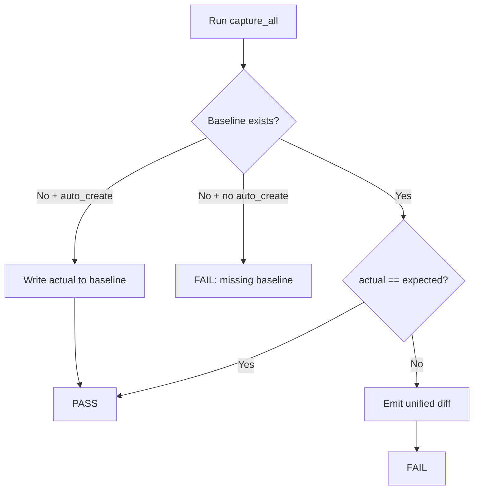

# Golden Master approve pattern (GM-1)

## 1. Purpose

Golden Master (Approval) tests capture the **serialized solver output** for fixed input scenarios and compare future runs against a version-controlled baseline. Any unintended change in output format or values fails the test with a unified diff.

## 2. Artifacts

| Artifact | Role |
|---|---|
| `tests/golden_master_expected.txt` | Version-controlled baseline (expected output) |
| `scripts/generate_golden_master.py` | Regenerates baseline from current solver |
| `tests/golden_master/approve.py` | Approve/compare logic |
| `tests/test_golden_master_magic_square.py` | Pytest entry point (GM-1, GM-2) |

## 3. Scenarios (GM-1)

| Section | Intent | Input summary |
|---|---|---|
| `[normal_success]` | small-first combination succeeds | PRD §16.4 small-first grid |
| `[reverse_success]` | reverse combination succeeds | PRD §16.4 reverse grid |
| `[invalid_blank_count]` | blank count ≠ 2 | three blanks |
| `[duplicate_number]` | duplicate non-zero value | duplicate `7` |
| `[no_valid_solution]` | both combinations fail | G1 partial grid |

## 4. Output capture strategy

Capture uses **Result DTO serialization** via `control.pipeline.MagicSquarePipeline`:

- **Success** — `Output:` line with `[r1, c1, n1, r2, c2, n2]`
- **Error** — `Error:` line with PRD error code (e.g. `INVALID_BLANK_COUNT`)

Stdout capture is not used; DTO serialization keeps comparisons stable across platforms (line endings normalized on write).

## 5. Baseline file structure

```text
[normal_success]
Input:
16 0 0 13
5 11 10 8
9 7 6 12
4 14 15 1
Output:
[1, 2, 2, 1, 3, 3]

________________________________________

[reverse_success]
...
```

Sections are separated by `________________________________________`.

## 6. Approve pattern flow



### Test mode (`tests/test_golden_master.py`)

- `auto_create=False` — baseline must exist; mismatch → unified diff + FAIL
- Baseline absence → FAIL with instructions to run the generator

### Generator mode (`scripts/generate_golden_master.py`)

- Writes current capture to `tests/golden_master_expected.txt`
- `--force` overwrites an existing baseline (use after intentional output changes)

## 7. Workflow

### Initial baseline creation

```powershell
python scripts/generate_golden_master.py
git add tests/golden_master_expected.txt
```

### Regression check

```powershell
python -m pytest tests/test_golden_master.py -v
```

### Intentional output change

1. Implement and verify the change deliberately.
2. Regenerate: `python scripts/generate_golden_master.py --force`
3. Review diff in `golden_master_expected.txt`.
4. Commit the updated baseline with the behavior change.

## 8. ECB alignment

| Layer | Responsibility in GM flow |
|---|---|
| `boundary` | `InputValidator` — blank count, duplicate checks |
| `control` | `MagicSquarePipeline` — orchestration, error mapping |
| `entity` | `MagicSquareSolver` — two-combination resolution |
| `tests/golden_master` | Capture, format, approve (test infrastructure only) |

Golden Master tests exercise the full `boundary → control → entity` path without `boundary → entity` direct dependency.

## 9. Failure example

When actual output diverges, pytest fails with:

```text
Golden Master mismatch — run `python scripts/generate_golden_master.py --force` to refresh:
--- golden_master_expected.txt (expected)
+++ golden_master_expected.txt (actual)
@@ ...
```

## 10. Related requirements

- GM-1: Golden Master baseline for Magic Square solver output
- PRD §12.2 Output Contract — `int[6]` success format
- PRD §13 Error codes — `INVALID_BLANK_COUNT`, `DUPLICATE_NON_ZERO_VALUE`, `NO_VALID_ASSIGNMENT`
