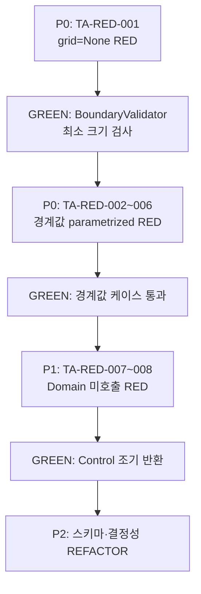

# MagicSquare 테스트 계획서

| 항목 | 내용 |
|---|---|
| **문서 버전** | 1.0 |
| **작성일** | 2026-05-29 |
| **대상 AC** | AC-FR01-01, AC-FR01-05 |
| **대상 FR** | FR-01 Input Verification (PRD §10) |
| **관련 BR** | BR-01 — 입력 행렬은 항상 4행 4열이어야 한다 (PRD §11) |
| **기준 샘플** | `grid = None` → `{ code: "INVALID_MATRIX_SIZE", message: "입력은 4x4 정수 행렬이어야 한다." }` |
| **기술 스택** | Python 3.11+, pytest, pydantic, unittest.mock |
| **테스트 프레임워크** | pytest (AAA 패턴) |
| **아키텍처** | ECB — Boundary → Control → Entity |

---

## 1. 목적 및 범위

본 계획서는 **FR-01 입력 크기 검증(AC-FR01-01)** 을 중심으로, Dual-Track TDD의 **Track A(Boundary Contract)** RED 단계에서 작성할 단위 테스트의 범위·우선순위·경계값·mock 전략·커버리지 목표를 정의한다.

### 1.1 In-Scope (본 계획)

- Boundary 계층 `BoundaryValidator`의 4×4 크기 선행 검증
- 표준 오류 응답 스키마(`code`, `message`) 계약 검증
- FR-01 실패 시 Domain resolver **미호출** 검증 (AC-FR01-05)
- pytest-cov 기반 Boundary/Entity 커버리지 측정 전략

### 1.2 Out-of-Scope (본 계획 — AC-FR01-01 범위 외)

| 항목 | 관련 AC | 별도 테스트 계획 |
|---|---|---|
| 빈칸 개수 검증 | AC-FR01-02 | Track A Phase 2 |
| 값 범위 검증 | AC-FR01-03 | Track A Phase 2 |
| 중복 값 검증 | AC-FR01-04 | Track A Phase 2 |
| Solver two-combination | AC-FR05-01~03 | Track B |
| **4×4 정상 입력** | — | **본 AC-FR01-01 스위트에 포함 금지** |

> **4×4 정상 입력**은 크기 검증 통과 케이스이므로 AC-FR01-01 전용 스위트에 넣지 않는다. 정상 경로는 Track B 및 FR-05 통합 테스트에서 별도 관리한다.

---

## 2. pytest 단위 테스트 범위 및 우선순위

### 2.1 테스트 디렉터리 구조 (예상)

```
tests/
├── boundary/
│   ├── test_boundary_validator_matrix_size.py   # P0 — AC-FR01-01
│   └── conftest.py                              # 공통 fixture, ErrorResponse 스키마
├── control/
│   └── test_solver_orchestration.py             # P1 — AC-FR01-05 (Domain 미호출)
└── entity/
    └── ...                                      # Track B (본 계획 2차)
```

> 구현 시 소스는 `src/` 하위 ECB 패키지로 배치한다.  
> 예: `src/boundary/validator.py`, `src/control/resolver.py`, `src/entity/...`

### 2.2 우선순위 매트릭스

| 우선순위 | 테스트 ID | 대상 레이어 | 검증 대상 | AC | RED 선행 조건 |
|---|---|---|---|---|---|
| **P0** | `TA-RED-001` | Boundary | `grid = None` → `INVALID_MATRIX_SIZE` | AC-FR01-01 | 없음 (최초 RED) |
| **P0** | `TA-RED-002` | Boundary | `grid = []` → `INVALID_MATRIX_SIZE` | AC-FR01-01 | TA-RED-001 GREEN |
| **P0** | `TA-RED-003` | Boundary | `grid = [[]]*4` → `INVALID_MATRIX_SIZE` | AC-FR01-01 | TA-RED-001 GREEN |
| **P0** | `TA-RED-004` | Boundary | 3×4 행렬 → `INVALID_MATRIX_SIZE` | AC-FR01-01 | TA-RED-001 GREEN |
| **P0** | `TA-RED-005` | Boundary | 4×3 행렬 → `INVALID_MATRIX_SIZE` | AC-FR01-01 | TA-RED-001 GREEN |
| **P0** | `TA-RED-006` | Boundary | 5×5 행렬 → `INVALID_MATRIX_SIZE` | AC-FR01-01 | TA-RED-001 GREEN |
| **P1** | `TA-RED-007` | Control | 크기 오류 시 `MagicSquareSolver.solve` 호출 0회 | AC-FR01-05 | P0 전체 GREEN |
| **P1** | `TA-RED-008` | Control | 크기 오류 시 `BlankFinder` / `MissingNumberFinder` 호출 0회 | AC-FR01-05 | P0 전체 GREEN |
| **P2** | `TA-RED-009` | Boundary | pydantic `ErrorResponse` 스키마 직렬화 검증 | AC-FR01-01 | P0 GREEN |
| **P2** | `TA-RED-010` | Boundary | 동일 입력 2회 호출 시 결정적(deterministic) 동일 응답 | NFR-03 | P0 GREEN |

### 2.3 실행 순서 (Dual-Track TDD)



### 2.4 AAA 패턴 적용 예시 (개념)

| 단계 | `TA-RED-001` 내용 |
|---|---|
| **Arrange** | `grid = None`, `BoundaryValidator` 인스턴스 준비 |
| **Act** | `result = validator.validate(grid)` 또는 `resolver.resolve(grid)` |
| **Assert** | `result.code == "INVALID_MATRIX_SIZE"`, message 일치, pydantic 스키마 통과 |

---

## 3. 경계값 케이스 목록 (AC-FR01-01)

모든 케이스는 **동일 기대 결과**를 반환해야 한다.

```json
{
  "code": "INVALID_MATRIX_SIZE",
  "message": "입력은 4x4 정수 행렬이어야 한다."
}
```

| TC ID | 입력 (`grid`) | 실패 원인 | 기대 code | AC-FR01-01 포함 | AC-FR01-05 Domain 미호출 |
|---|---|---|---|---|---|
| `TC-EXC-001a` | `None` | 행렬 객체 부재 (null) | `INVALID_MATRIX_SIZE` | ✅ | ✅ |
| `TC-EXC-001b` | `[]` | 행 0개 | `INVALID_MATRIX_SIZE` | ✅ | ✅ |
| `TC-EXC-001c` | `[[]] * 4` | 행 4개, 열 0개 | `INVALID_MATRIX_SIZE` | ✅ | ✅ |
| `TC-EXC-001d` | 3×4 행렬 (행 3, 열 4) | 행 수 ≠ 4 | `INVALID_MATRIX_SIZE` | ✅ | ✅ |
| `TC-EXC-001e` | 4×3 행렬 (행 4, 열 3) | 열 수 ≠ 4 | `INVALID_MATRIX_SIZE` | ✅ | ✅ |
| `TC-EXC-001f` | 5×5 행렬 | 행·열 모두 ≠ 4 | `INVALID_MATRIX_SIZE` | ✅ | ✅ |
| ~~`TC-NOR-xxx`~~ | ~~4×4 정상 입력~~ | — | — | **❌ 포함 금지** | — |

### 3.1 경계값 입력 상세

#### `TC-EXC-001a` — `grid = None`

```python
grid = None
```

- **의미**: 호출자가 행렬을 전달하지 않았거나 null 참조
- **검증 포인트**: `TypeError` 예외 throw 금지 → 표준 오류 응답 반환 (PRD §13 정책)

#### `TC-EXC-001b` — `grid = []`

```python
grid = []
```

- **의미**: 빈 리스트 — 행렬 구조 자체 없음
- **검증 포인트**: `len(grid) != 4` 조기 판정

#### `TC-EXC-001c` — `grid = [[]] * 4`

```python
grid = [[]] * 4
# [[], [], [], []]
```

- **의미**: 행은 4개이나 각 행의 열 길이가 0
- **검증 포인트**: 행 수 통과 후 **열 길이 검사**에서 실패해야 함 (BR-01)

#### `TC-EXC-001d` — 3×4 행렬

```python
grid = [
    [1, 2, 3, 4],
    [5, 6, 7, 8],
    [9, 10, 11, 12],
]
```

- **의미**: PRD §16.4 `invalid size` 대표 데이터와 동일 유형 (3행)

#### `TC-EXC-001e` — 4×3 행렬

```python
grid = [
    [1, 2, 3],
    [4, 5, 6],
    [7, 8, 9],
    [10, 11, 12],
]
```

- **의미**: 행 수는 4이나 열 수 불일치

#### `TC-EXC-001f` — 5×5 행렬

```python
grid = [[1, 2, 3, 4, 5] for _ in range(5)]
```

- **의미**: 정방향이나 4×4가 아닌 확장 격자

### 3.2 pytest parametrized 적용 권장

```python
# 개념 예시 — 실제 구현 시 tests/boundary/ 에 배치
@pytest.mark.parametrize(
    "grid,case_id",
    [
        (None, "TC-EXC-001a"),
        ([], "TC-EXC-001b"),
        ([[]] * 4, "TC-EXC-001c"),
        ([[1,2,3,4],[5,6,7,8],[9,10,11,12]], "TC-EXC-001d"),
        ([[1,2,3],[4,5,6],[7,8,9],[10,11,12]], "TC-EXC-001e"),
        ([[1,2,3,4,5] for _ in range(5)], "TC-EXC-001f"),
    ],
    ids=["none", "empty", "four_empty_rows", "3x4", "4x3", "5x5"],
)
def test_invalid_matrix_size_returns_standard_error(grid, case_id): ...
```

---

## 4. 예외·특이 케이스 목록

AC-FR01-01 크기 검증과 연관되나, 경계값 표 외에 별도로 다룰 특이 케이스이다.

| TC ID | 입력 / 조건 | 기대 동작 | 검증 목적 |
|---|---|---|---|
| `TC-EXC-SP-001` | `grid = ""` (빈 문자열) | `INVALID_MATRIX_SIZE` | 타입 계약 위반 — iterable 아님 |
| `TC-EXC-SP-002` | `grid = 12345` (정수 스칼라) | `INVALID_MATRIX_SIZE` | 타입 계약 위반 |
| `TC-EXC-SP-003` | `grid = [[1,2,3,4], [5,6,7], [9,10,11,12], [13,14,15,16]]` | `INVALID_MATRIX_SIZE` | **가변 길이 행**(jagged array) |
| `TC-EXC-SP-004` | `grid = [None, None, None, None]` | `INVALID_MATRIX_SIZE` | 행 4개이나 각 행이 null |
| `TC-EXC-SP-005` | `grid = [[1,2,3,4,"x"], ...]` (4×4) | `INVALID_MATRIX_SIZE` 또는 후속 AC | **본 스위트 1차 RED에서는 제외** — 값 타입은 AC-FR01-03 범위 |
| `TC-EXC-SP-006` | 동일 `grid=None` 100회 반복 호출 | 항상 동일 code/message | NFR-03 결정적 실행 |
| `TC-EXC-SP-007` | 크기 오류 입력 후 원본 `grid` 변경 없음 | 입력 side-effect 없음 | NFR-04 |
| `TC-EXC-SP-008` | `grid = [[]]*4` 후 `grid[0].append(1)` | aliasing 안전 — 검증 로직이 공유 참조에 오염되지 않음 | Python `[[]]*4` 함정 |

> **정책**: 예외 throw 대신 표준 오류 응답 반환 (PRD §13). `pytest.raises`는 Domain 내부 불리언 판정 등 **의도적 예외 계약**에만 사용한다.

---

## 5. Domain Resolver 진입점 호출 횟수 검증 전략

### 5.1 검증 대상 (AC-FR01-05)

FR-01 크기 검증 실패 시, Control 계층은 Domain resolver를 **단 한 번도 호출하지 않아야** 한다.

| Mock 대상 | 레이어 | 역할 | 기대 호출 횟수 |
|---|---|---|---|
| `MagicSquareSolver.solve` | Control/Entity | two-combination 유스케이스 진입점 | **0** |
| `BlankFinder.find` | Entity | 빈칸 좌표 탐색 | **0** |
| `MissingNumberFinder.find` | Entity | 누락 숫자 탐색 | **0** |
| `MagicSquareValidator.is_valid` | Entity | 마방진 판정 | **0** |

### 5.2 Mock vs Spy 선택 기준

| 기법 | 사용 시점 | 도구 |
|---|---|---|
| **Mock (교체)** | Control 테스트 — Domain을 완전히 격리하고 호출 여부만 검증 | `unittest.mock.create_autospec` |
| **Spy (래핑)** | 통합 테스트 — 실제 구현 유지하며 call_count 관측 | `unittest.mock.patch` + `wraps=` |
| **Dependency Injection** | 프로덕션 코드 — 테스트에서 mock 주입 가능한 생성자/함수 인자 | pytest fixture |

**본 AC-FR01-01 1차 RED 권장**: Control 계층 단위 테스트에서 **Mock(교체)** 방식을 사용한다. Domain 구현이 아직 없어도 RED를 작성할 수 있다.

### 5.3 Control 계층 Mock 패턴 (개념)

```python
from unittest.mock import create_autospec, MagicMock

def test_size_validation_failure_does_not_call_domain_solver():
    # Arrange
    mock_solver = create_autospec(MagicSquareSolver, instance=True)
    control = MagicSquareControl(solver=mock_solver)
    grid = None

    # Act
    result = control.resolve(grid)

    # Assert — 응답 계약
    assert result.code == "INVALID_MATRIX_SIZE"

    # Assert — Domain 미호출 (AC-FR01-05)
    mock_solver.solve.assert_not_called()
    assert mock_solver.solve.call_count == 0
```

### 5.4 Spy 패턴 (REFACTOR / 통합 회귀)

```python
from unittest.mock import patch

def test_boundary_blocks_before_domain_entry():
    grid = []
    with patch(
        "src.control.resolver.MagicSquareSolver.solve",
        wraps=MagicSquareSolver().solve,
    ) as spy_solve:
        result = boundary_entry.resolve(grid)

    assert result.code == "INVALID_MATRIX_SIZE"
    spy_solve.assert_not_called()
```

### 5.5 검증 체크리스트

- [ ] 크기 오류 6종(TC-EXC-001a~f) **각각**에 대해 Domain 진입점 call_count == 0
- [ ] Mock이 **autospec**으로 실제 API 시그니처를 강제 (오타·존재하지 않는 메서드 mock 방지)
- [ ] Boundary 단독 테스트(P0)와 Control orchestration 테스트(P1) **분리** — ECB 책임 혼합 금지
- [ ] Domain mock이 Boundary 테스트에 누출되지 않음 (`boundary -> entity` 직접 의존 금지)

---

## 6. pydantic 오류 응답 스키마 검증

Boundary 계층의 표준 오류 응답은 pydantic 모델로 계약을 고정한다.

```python
# 개념 — src/boundary/schemas.py
from pydantic import BaseModel

class ErrorResponse(BaseModel):
    code: str
    message: str
```

| 검증 항목 | 방법 |
|---|---|
| 필수 필드 존재 | `ErrorResponse.model_validate(result_dict)` |
| code enum 고정 | `Literal["INVALID_MATRIX_SIZE", ...]` 또는 StrEnum |
| message 비어 있지 않음 | pydantic `min_length=1` |
| 추가 필드 금지 | `model_config = ConfigDict(extra="forbid")` |

---

## 7. 커버리지 목표

PRD NFR-01, NFR-02 및 프로젝트 Engineering Principles(§20)에 따른 목표이다.

| 레이어 | 패키지 (예상) | 목표 | 측정 범위 |
|---|---|---|---|
| **Entity (Domain)** | `src/entity/` | **≥ 95%** | BlankFinder, MissingNumberFinder, MagicSquareValidator, Solver 정책 |
| **Boundary** | `src/boundary/` | **≥ 85%** | BoundaryValidator, ErrorResponse, ResultFormatter |
| **Control** | `src/control/` | **≥ 85%** | orchestration, 조기 반환 분기 |

### 7.1 본 AC-FR01-01 스프린트 최소 커버리지

| 모듈 | 1차 RED-GREEN 목표 | 비고 |
|---|---|---|
| `boundary/validator.py` — `_is_valid_size()` | **100%** | P0 케이스 6종 |
| `boundary/validator.py` — `validate()` | **≥ 90%** | 크기 실패 분기 |
| `control/resolver.py` — 조기 반환 분기 | **100%** | AC-FR01-05 |

> Track B Domain 구현 전에는 Entity 커버리지 95%를 **전체 프로젝트 마일스톤**으로 관리하고, 본 스프린트에서는 Boundary/Control 크기 검증 분기를 우선 100%로 달성한다.

---

## 8. pytest-cov 측정 전략

### 8.1 설치

```bash
pip install pytest-cov
```

### 8.2 기본 실행 (전체)

```bash
pytest --cov=src --cov-report=term-missing
```

### 8.3 레이어별 측정 (권장)

```bash
# Boundary only — AC-FR01-01 스프린트
pytest tests/boundary/ --cov=src/boundary --cov-report=term-missing --cov-fail-under=85

# Control — Domain 미호출 검증
pytest tests/control/ --cov=src/control --cov-report=term-missing --cov-fail-under=85

# Entity — Track B (후속)
pytest tests/entity/ --cov=src/entity --cov-report=term-missing --cov-fail-under=95
```

### 8.4 CI / 로컬 통합 리포트

```bash
pytest \
  --cov=src \
  --cov-report=term-missing \
  --cov-report=html:coverage_html \
  --cov-fail-under=85
```

| 옵션 | 용도 |
|---|---|
| `--cov=src` | 소스 루트 기준 측정 |
| `--cov-report=term-missing` | 터미널에 미커버 라인 번호 출력 |
| `--cov-report=html` | HTML 상세 리포트 (로컬 디버깅) |
| `--cov-fail-under=N` | CI 게이트 — 미달 시 exit code 2 |
| `-x` | 첫 실패 시 중단 (RED 확인용) |
| `-k "matrix_size"` | AC-FR01-01 관련 테스트만 선택 실행 |

### 8.5 `.coveragerc` 또는 `pyproject.toml` 권장 설정

```ini
# .coveragerc (개념)
[run]
source = src
branch = True
omit =
    */tests/*
    */__init__.py

[report]
precision = 1
show_missing = True
skip_covered = False
```

```toml
# pyproject.toml (개념)
[tool.coverage.run]
source = ["src"]
branch = true

[tool.coverage.report]
fail_under = 85
show_missing = true
```

### 8.6 커버리지 해석 가이드

| 상황 | 조치 |
|---|---|
| Boundary 85% 미달 | AC-FR01-02~04 분기 테스트 추가 (Phase 2) |
| Entity 95% 미달 | Track B RED 테스트 보강 — 테스트 삭제 금지 |
| 100% line cover이나 branch 미달 | `grid=None` vs `grid=[]` 등 **분기별** assert 추가 |
| Control orchestration 미측정 | `tests/control/` 스위트 추가 |

---

## 9. 추적성 매트릭스 (본 계획)

| Concept | BR | FR | AC | Test ID | TC ID | Component |
|---|---|---|---|---|---|---|
| 4×4 입력 | BR-01 | FR-01 | AC-FR01-01 | TA-RED-001~006 | TC-EXC-001a~f | BoundaryValidator |
| Domain 미호출 | BR-01~04 | FR-01 | AC-FR01-05 | TA-RED-007~008 | TC-EXC-001a~f | Control + Mock Solver |
| 결정적 실행 | — | — | NFR-03 | TA-RED-010 | TC-EXC-SP-006 | BoundaryValidator |
| 입력 불변 | — | — | NFR-04 | — | TC-EXC-SP-007 | BoundaryValidator |

---

## 10. Definition of Done (본 스프린트)

- [ ] P0 테스트 6종(TC-EXC-001a~f) RED → GREEN 완료
- [ ] P1 Domain 미호출 테스트(TA-RED-007~008) GREEN
- [ ] 4×4 정상 입력이 AC-FR01-01 스위트에 **포함되지 않음** 확인
- [ ] 모든 크기 오류 케이스가 `INVALID_MATRIX_SIZE` 단일 code 반환 (R-UI-002)
- [ ] pydantic `ErrorResponse` 스키마 검증 통과
- [ ] `pytest --cov=src/boundary --cov-fail-under=85` 통과
- [ ] REFACTOR 후 전체 P0+P1 회귀 그린
- [ ] 테스트 삭제·약화 없음 (PRD §15.3, §20)

---

## 11. 참고 문서

| 문서 | 경로 |
|---|---|
| PRD | `docs/PRD_MagicSquare.md` |
| Dual-Track TDD 설계 | `Report/02. 4x4_MagicSquare_Dual-Track_TDD_CleanArchitecture_Design_Report.md` |
| TDD 규칙 | `.cursor/rules/magicsquare-tdd-testing.mdc` |
| ECB 아키텍처 규칙 | `.cursor/rules/magicsquare-ecb-architecture.mdc` |

---

*본 문서는 AC-FR01-01(`grid=None → INVALID_MATRIX_SIZE`) 샘플을 기준으로 Track A RED 단계 테스트 계획을 정의한다. FR-01 나머지 AC 및 Track B Domain 테스트는 별도 계획으로 확장한다.*
